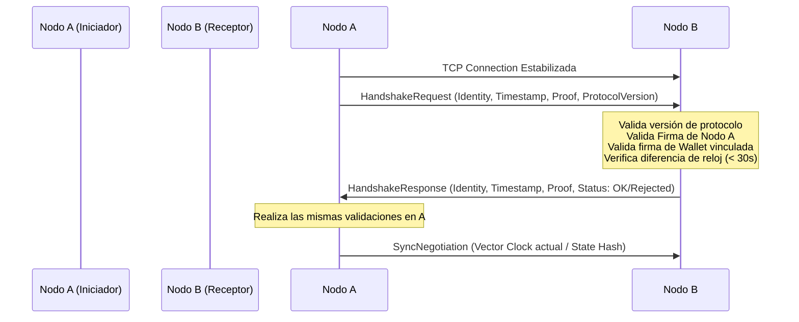

# Plan de Desarrollo Arquitectónico: DevAntigravityIA
**Rol**: Arquitectura de Metaverso, Contratos Técnicos, Seguridad y Evolución del Estado P2P  
**Fecha**: 2026-06-29  
**Proyecto**: WoldVirtual P2P 3D  
**Rama de Trabajo**: DevAntigravityIA  

---

## 🏛️ 1. Visión y Resumen Ejecutivo

WoldVirtualP2P3D se basa en la premisa inquebrantable de **1 Usuario = 1 Isla = 1 Nodo = 1 Servidor**. Para sostener esta arquitectura descentralizada extrema frente a la censura y la asfixia regulatoria, la base técnica no debe depender de bases de datos centralizadas, servidores de orquestación tradicionales ni DNS públicas. El metaverso se levanta como una red mesh de nodos que colaboran entre sí.

Este plan de desarrollo detallado establece el diseño arquitectónico y las especificaciones técnicas para que **DevAntigravityIA** guíe la evolución del visor C# (WPF) y del motor Godot (C#/GDScript). El objetivo fundamental es pasar de un prototipo de sincronización de archivos JSON locales a una **arquitectura de estado P2P robusta, criptográficamente segura y modular**.

---

## 🔒 2. Contratos y Especificaciones Técnicas

### 2.1. Contrato de Identidad Única del Nodo (`Node Identity`)
La identidad de un nodo de WoldVirtual debe ser autoritativa, autocontenida y criptográficamente verificable sin consultar a un tercero.

*   **Esquema de Identidad**: Basado en identificadores descentralizados efímeros y firmas de clave pública.
*   **Identificador del Nodo (DID)**: `did:wv:node:<Hash_SHA256_Clave_Publica>`
*   **Criptografía**: Ed25519 para firmas ultrarrápidas y seguras (o Secp256k1 para compatibilidad directa con MetaMask/Web3).
*   **Vínculo con MetaMask/Wallet**: 
    1. El usuario se autentica a través de MetaMask en el wizard local.
    2. MetaMask firma un payload de vinculación: `Firmar("WoldVirtual Node Identity Binding:" + NodePublicKey + Timestamp)`.
    3. C# verifica la firma de Ethereum de manera local. Si es válida, asocia la clave pública del nodo (`NodePublicKey`) con la `wallet_address`.
    4. Esta relación se firma localmente por el nodo y se expone como prueba de posesión (`Proof of Ownership`).
*   **Persistencia Segura**: La clave privada del nodo se almacena utilizando **Windows Data Protection API (DPAPI)** en el perfil de usuario local (`AppData/Local/WoldVirtual/node.key`), quedando completamente fuera del control de versiones de Git.

#### Interfaz Propuesta (C#)
```csharp
namespace WoldVirtual.Core.Identity
{
    public interface INodeIdentity
    {
        string NodeId { get; }          // did:wv:node:<hash>
        string WalletAddress { get; }   // 0x...
        byte[] PublicKey { get; }
        
        byte[] SignPayload(byte[] data);
        bool VerifyPayload(byte[] data, byte[] signature);
        
        // Genera la prueba de posesión de la billetera vinculada
        WalletBindingProof GetBindingProof();
    }

    public record WalletBindingProof(
        string WalletAddress,
        string NodePublicKeyHex,
        long Timestamp,
        string SignatureHex
    );
}
```

---

### 2.2. Protocolo de Handshake P2P
Cuando un nodo detecta la presencia de otro a través de UDP Broadcast o el IPFS DHT, debe realizar un handshake formal antes de procesar cualquier estado.

#### Flujo del Handshake


#### Payload JSON del Handshake
```json
{
  "protocol_version": "1.0",
  "sender_id": "did:wv:node:f83a73c09b...",
  "wallet_address": "0x9826a7C841E34b...",
  "timestamp": 178593452,
  "node_signature": "0xa6f8c7...",
  "binding_proof": {
    "wallet_address": "0x9826a7C841E34b...",
    "node_public_key": "0x038c92a...",
    "timestamp": 178593450,
    "signature": "0x5c8e..."
  },
  "capabilities": ["chat", "avatar_sync", "island_sync"]
}
```

#### Estado de implementación (sección 2.2)
*   [x] **Handshake formal** (`Services/HandshakeProtocol.cs`): genera `HandshakeRequest`/`HandshakeResponse` con versión `1.0`, `sender_id`, `wallet_address`, timestamp, `node_signature`, `binding_proof` y capacidades.
*   [x] **Validación local**: verifica versión de protocolo, NodeId seguro, ventana de reloj de 30 segundos, correspondencia `sender_id` ↔ hash SHA-256 de la clave pública, firma ECDSA del nodo y prueba de wallet (simulada en entorno local mediante `MetaMaskValidator`, extensible a recuperación Ethereum real).
*   [x] **Tests** (`VisorSingularity.Tests/HandshakeTests.cs`): handshake válido, rechazo por `sender_id` manipulado, timestamp expirado, wallet simulada deshabilitada y mensaje de binding determinista. Suite total **35/35 en verde**.

---

### 2.3. Modelo de Confianza y Validación entre Peers (`Trust Model`)
Para mitigar ataques de denegación de servicio (DoS), suplantación de identidad (spoofing) y ataques de replay:

1.  **Firma del Estado**: Cada actualización del estado de un par (`peer_{remoteId}.json`) debe llevar un bloque de firma criptográfica (`"sig"`) firmado por la clave del nodo emisor.
2.  **Prevención de Replay**: El estado contiene un número de secuencia estrictamente monotónico (`seq`) y un timestamp. Actualizaciones con `seq` menor o igual al último procesado son ignoradas de inmediato.
3.  **Saneamiento de IDs y Rutas**:
    *   **CRÍTICO**: El `remoteId` recibido en la red debe validarse mediante una expresión regular estricta (`^[a-zA-Z0-9_\-]+$`) antes de interactuar con el sistema de archivos.
    *   Cualquier presencia de caracteres de separación de ruta (`/`, `\`, `..`) en el identificador resultará en el descarte inmediato del paquete y bloqueo temporal de la IP de origen en el firewall del nodo.
4.  **Límites de Carga**:
    *   Tamaño máximo de payload de actualización: **64 KB**.
    *   Tasa máxima de actualizaciones permitidas: **5 actualizaciones por segundo por peer**.

---

### 2.4. Evolución de la Sincronización: De JSONs Locales a Sincronización Distribuida
El modelo actual lee/escribe en disco mediante `FileSystemWatcher` en C# y Godot. Esto añade latencia e introduce degradación del rendimiento de almacenamiento (I/O).

```mermaid
graph TD
    subgraph Fase Actual (Polling e I/O de Disco)
        A[C# PeerSyncService] -- UDP Broadcast --> B[Red LAN/Internet]
        A -- Escribe peer_*.json --> C[(Estado_Global/peers)]
        D[Godot NetworkLayer.gd] -- Polling de disco --> C
    end
    
    subgraph Fase Objetivo (Arquitectura Eventos & WebSocket)
        E[C# P2P Service] -- WebSocket Local --> F[Godot IPC Server]
        E -- P2P Mesh Network --> G[Peers Remotos]
    end
```

#### Plan de Transición
1.  **Fase Intermedia (Memoria Compartida con Mapeo de Archivos / Memory-Mapped Files)**:
    *   En lugar de escribir archivos JSON tradicionales para cada tick de posición de avatar, C# y Godot utilizan un archivo mapeado en memoria (`Memory-Mapped File`) para datos volátiles de posición rápida (latencia < 5ms).
    *   Los datos estáticos y estructurales (islas creadas, perfiles de usuario) se siguen sincronizando vía JSON.
2.  **Fase Final (Capa de Red Event-Driven con WebSockets locales)**:
    *   Godot levanta un cliente WebSocket local que se conecta al nodo C# (`http://127.0.0.1:8082`).
    *   Todo intercambio de información se realiza mediante eventos en memoria estructurados. C# actúa como enrutador y validador local de la red P2P, aislando por completo a Godot de la lógica de sockets UDP y túneles SSH.
    *   Para la consistencia del estado agregamos un modelo de resolución de conflictos **CRDT (Conflict-free Replicated Data Type)** del tipo *LWW-Element-Set* (Last-Write-Wins) basado en el timestamp criptográfico firmado.

---

### 2.5. Criterios de Consistencia, Bootstrap y Recuperación
1.  **Bootstrap de Red**:
    *   **Local**: UDP multicast/broadcast en puerto 50099.
    *   **Internet**: Lista de nodos semilla (Bootstrap Peers) alojada en la red IPFS (mediante un CID IPNS fijo) y cargada en el arranque del visor C#.
2.  **Detección de Caídas**:
    *   Los nodos envían un heartbeat cada 3 segundos.
    *   Si no se recibe actividad de un peer durante 35 segundos (`PEER_STALE_SECONDS`), se marca como inactivo.
    *   Si se superan los 60 segundos, se purga de la memoria RAM y se notifica al motor Godot para retirar su avatar de la escena 3D.
3.  **Recuperación tras Desconexiones (Split-Brain / Network Partition)**:
    *   Al reconectarse, los nodos comparan sus Vector Clocks.
    *   El nodo con el estado más antiguo solicita un "Catch-up State Sync" al nodo con el estado más reciente.
    *   Los conflictos de posesión de islas se resuelven mediante la firma de autoría: solo la clave vinculada a la billetera creadora del ID de la isla puede modificar los datos estructurales de dicha isla.

#### Estado de implementación (sección 2.5)
*   [x] **Vector Clock** (`Services/VectorClock.cs`): contador monotónico por nodo, `Increment`/`Merge` (join del semilattice) y `CompareTo` que distingue `Before`/`After`/`Equal`/`Concurrent` (detección de split-brain). Serialización JSON robusta para el campo `vc` del estado del peer.
*   [x] **Resolvedor de conflictos** (`Services/ConflictResolver.cs`): tres capas — (1) anti-replay por `seq` monotónico (sección 2.3), (2) causalidad por Vector Clock con desempate **LWW** sobre timestamp firmado en estados concurrentes, (3) **autoría de isla** (solo la wallet creadora puede modificar datos estructurales; el primer creador queda registrado de forma inmutable).
*   [x] **Integración en `PeerSyncService.cs`**: cada broadcast local incrementa `seq` y el Vector Clock y los incrusta **dentro del payload firmado**; cada estado entrante pasa por `ResolveIncomingState` (anti-replay + causalidad + autoría) antes de persistirse; los intentos de modificar islas ajenas se contabilizan como inyección en la telemetría.
*   [x] **Tests** (`VisorSingularity.Tests/ConsensusTests.cs`): causalidad, concurrencia, merge, round-trip JSON, anti-replay, autoría, resolución LWW y protocolo de catch-up. Suite total **23/23 en verde**.
*   [x] **Catch-up State Sync** (`Services/CatchupProtocol.cs` + handlers en `PeerSyncService.cs`): los nodos difunden `HELLO` con su reloj vectorial en cada heartbeat; al detectar un peer causalmente más avanzado o concurrente (`ShouldRequestCatchup`) el nodo atrasado envía `SYNC_REQ` (unicast) y recibe `SYNC_RESP` con el estado completo firmado, reconciliado por la misma ruta de validación/resolución. Los mensajes de control viajan por el mismo socket UDP, distinguidos por el campo `_t` para no interferir con los broadcasts de estado.
*   [x] **Bootstrap por IPNS** (`Services/BootstrapPeerService.cs`): al arrancar `PeerSync`, el visor resuelve la lista de nodos semilla publicada bajo un nombre IPNS fijo a través de varios gateways IPFS públicos (sin depender de un Kubo local), valida cada entrada (NodeId, host sin inyección de rutas, puerto válido) y cachea la última lista buena en `Estado_Global/bootstrap_peers.json` para bootstrap offline. `PeerSyncService.GreetSeedPeers` envía un `HELLO` unicast a cada semilla, permitiendo descubrir la malla más allá de la LAN. Cubierto por `BootstrapTests` (7 casos).

---

## 🛠️ 3. Aislamiento de Capas y Refactorización WPF

Para solucionar la deuda técnica **DT-03 (MainWindow concentrado)** y **DT-05 (P2P incompleto)**, proponemos una separación estricta de responsabilidades:

```
[ Capa de Presentación (WPF UI) ]
      │ (MainWindow.xaml.cs, ViewModels)
      ▼
[ Capa de Control de Sesión (WoldVirtual.Core) ]
      │ (MetaverseSessionController, SessionManager)
      ▼
[ Capa de Seguridad e Identidad ]
      │ (NodeIdentity, CryptographyProvider)
      ▼
[ Capa de Transporte y Sincronización (P2P Network) ]
      └─► UDP LAN / Broadcast (PeerSyncService)
      └─► SSH Tunnels / Public Gateway (P2PWebNode)
      └─► IPFS / Kubo Bridge (IpfsManager)
```

---

## 📋 4. Prioridades de Desarrollo y Flujo de Trabajo

Fijamos el siguiente roadmap estructurado en fases para mantener un flujo de trabajo sin regresiones y mitigar los riesgos principales:

### Fase 1: Estabilización de Build y Contrato de Identidad
*   **Prioridad**: Alta/Urgente.
*   **Tareas**:
    *   [x] Corregir sintaxis rota en `VisorSingularity.csproj` (XML corrupto y referencias redundantes).
    *   [x] Resolver error de compilación `NETSDK1150` (ejecutable no independiente referenciando a otro) desactivando temporalmente `SelfContained` para builds locales de desarrollo.
    *   [x] Corregir error de archivo ausente `app.manifest`.
    *   [x] Implementar la clase de identidad local `NodeIdentity` (ECDSA secp256k1 con fallback nistP256) con persistencia segura en C# usando DPAPI. **Corregido bug de doble prefijo en `DID`**: `NodeId` ahora es el hash SHA-256 puro (64 hex) y `DID` lo formatea una sola vez (`did:wv:node:<hash>`), compatible con el saneamiento de `PeerSyncService`.
    *   [x] Crear tests unitarios en C# para verificar la generación y validación de firmas criptográficas de nodos y billeteras (`VisorSingularity.Tests/IdentityTests.cs`, 5/5 en verde).

### Fase 2: Implementación de Handshake y Modelo de Confianza
*   **Prioridad**: Alta.
*   **Tareas**:
    *   [x] Definir el esquema JSON estricto para peers remotos (`Identity/peer.schema.json`).
    *   [x] Integrar la validación criptográfica en `PeerSyncService.cs` antes de persistir los archivos JSON de los peers en disco (verificación de firma ECDSA sobre el payload sin `sig`/`pubkey`).
    *   [x] Implementar el saneamiento estricto contra inyección de directorios (Directory Traversal) en los identificadores de peers (`peerId`) con regex `^[a-fA-F0-9]{64}$ | ^[a-zA-Z0-9_\-]+$`.
    *   [x] Desarrollar pruebas automatizadas de inyección (reglas de Directory Traversal cubiertas en `IdentityTests`). Pendiente: ampliar con casos de payloads firmados incorrectamente sobre el socket real.

### Fase 3: Transición de Estado y Sincronización en Memoria
*   **Prioridad**: Media-Alta.
*   **Tareas**:
    *   [x] Refactorizar `NetworkLayer.gd` en Godot para unificar el consumo del estado vía `WebSocketPeer` (`ws://127.0.0.1:8082/ws`).
    *   [x] Diseñar e implementar el puente WebSocket local en C# (servidor `HttpListener` con `AcceptWebSocketAsync` dentro de `P2PWebNode`, puerto 8082) para transmitir los cambios en tiempo real a Godot sin I/O constante de disco.
    *   [x] Adaptar Godot para consumir este stream de red en memoria. **Riesgo resuelto**: C# publica el puerto WebSocket real en `Estado_Global/ws_port.txt` (`MetaverseSessionController.PublishWebSocketPort`) y Godot lo lee dinámicamente (`NetworkLayer._read_ws_port`) con reconexión automática cada 3 s (`_connect_ws`), eliminando el desajuste cuando 8082 está ocupado y la carrera de arranque (Godot conecta antes de que el servidor C# exista).

### Fase 4: Desacoplamiento de Servicios de Red en WPF
*   **Prioridad**: Media.
*   **Tareas**:
    *   [x] Extraer la lógica de orquestación masiva de `MainWindow.xaml.cs` hacia `Services/MetaverseSessionController.cs`.
    *   [x] Mover servicios a infraestructura dedicada (`Services/UdpChatService.cs`, `Services/GodotLauncherService.cs`, `Services/HardwareFingerprintService.cs`).
    *   [x] Instrumentar el manejo de timeouts, reconexiones automáticas y telemetría de red. **Implementado**: nuevo `Services/NetworkTelemetryService.cs` (singleton thread-safe con contadores de tráfico, firmas rechazadas, intentos de inyección, peers activos/expirados y reconexiones); `PeerSyncService` emite estas métricas; `P2PWebNode.MonitorTunnelAsync` reestablece el túnel caído con backoff exponencial acotado; `MetaverseSessionController` expone `NetworkTelemetry`/`NetworkTelemetrySummary` y el evento `NetworkTelemetryUpdated` a la UI. Cubierto por `Test_NetworkTelemetry_CountsTrafficAndSecurityEvents`.

---

## ⚠️ 5. Gestión de Riesgos y Mitigación

1.  **Riesgo de Cierre de Ley MiCA y Regulación Financiera**:
    *   *Mitigación*: Mantener el token nativo `WCVcoin` e islas 100% aislados de pasarelas FIAT locales. Todo se liquida contra criptos descentralizadas directo en el DEX3D. El diseño P2P del metaverso mediante túneles SSH efímeros garantiza la imposibilidad de apagar la red mediante secuestro de servidores centralizados.
2.  **Ataque de Suplantación de Identidad (Identity Spoofing)**:
    *   *Mitigación*: Cualquier paquete UDP/TCP recibido de un peer que carezca de una firma de nodo válida y vinculada a la clave del DID será descartado instantáneamente.
3.  **Agotamiento de Recursos Locales (DoS por almacenamiento o RAM)**:
    *   *Mitigación*: Implementación estricta de cuotas en `QuotaManager.cs` y eliminación automática de peers inactivos. El directorio `Estado_Global/peers` tiene una cuota máxima de 64 MB.

---

## 📈 6. Definición de Listo (Definition of Done) del Ciclo

El trabajo se considerará finalizado cuando:
1.  **VisorSingularity** compile de manera limpia bajo .NET 8 / Windows sin errores de restauración ni de manifiestos.
2.  Los contratos de identidad y handshake estén programados en C# con cobertura de tests unitarios que simulen ataques.
3.  Se verifique que el paso de datos a disco está libre de Directory Traversal.
4.  El README global y los planes de trabajo de las IAs se mantengan alineados y sincronizados.
