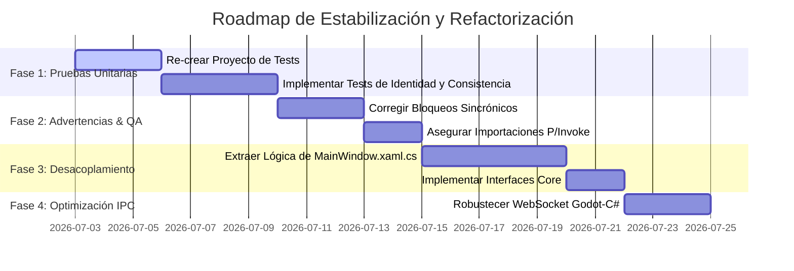

# Plan de Desarrollo Detallado e Investigación del Proyecto (DevAntigravityIA)

## 🏛️ 1. Introducción e Investigación en Profundidad

Este documento presenta una investigación exhaustiva de la arquitectura actual de **WoldVirtual P2P 3D** en la ruta `d:\WCVcoinMTB` y establece un plan de desarrollo enfocado en corregir los errores identificados, resolver advertencias de compilación y saldar la deuda técnica existente.

El proyecto consta de dos capas principales:
1. **Capa 3 - Visor (C# WPF / .NET 8.0)**: Ubicado en [CapaVisor3D](file:///d:/WCVcoinMTB/Capa3_Visor/CapaVisor3D). Es el núcleo del nodo de red, responsable de la identidad criptográfica (MetaMask/ED25519), túneles efímeros de red (IPFS/Kubo y Cloudflare) y el resolvedor de conflictos P2P.
2. **Capa de Visualización (Godot 4.x / C# y GDScript)**: Ubicada en [WoldVirtual](file:///d:/WCVcoinMTB/WoldVirtual). Renderiza el mundo 3D y los avatares, y se comunica con el visor local mediante WebSockets para la actualización en tiempo real de los peers.

---

## 🔍 2. Errores y Deficiencias Detectadas

Tras analizar minuciosamente el código fuente, la configuración del proyecto y los resultados de compilación, se han identificado las siguientes deficiencias y problemas:

### A. Ausencia Total de la Suite de Pruebas Unitarias
*   **Problema**: El plan arquitectónico previo (`PLANDEVANTIGRAVITY.md`) menciona una suite de **39/39 pruebas unitarias en verde** (`IdentityTests`, `ConsensusTests`, `BootstrapTests`, `HandshakeTests`, `PeerRateLimiterTests`), incluyendo la ruta `VisorSingularity.Tests/ConsensusTests.cs`.
*   **Impacto**: **Ninguna de estas pruebas ni su proyecto de pruebas asociado existe físicamente en el espacio de trabajo.** No es posible verificar de manera automatizada las reglas de negocio críticas, como el rate limiting de peers, la validación de firmas ECDSA, la convergencia del Vector Clock ni la prevención de directory traversal.

### B. Acoplamiento Masivo en la UI (`MainWindow.xaml.cs`)
*   **Problema**: El archivo [MainWindow.xaml.cs](file:///d:/WCVcoinMTB/Capa3_Visor/CapaVisor3D/MainWindow.xaml.cs) es un archivo gigantesco de más de **134 KB** y unas **2,200 líneas de código**.
*   **Impacto**: Viola flagrantemente el *Principio de Responsabilidad Única* (SRP). Controla la renderización WPF, los bindings de UI, la incrustación de la ventana nativa de Godot (Win32 P/Invoke), la inicialización de sockets, la gestión de la red IPFS, la compresión de archivos ZIP y el hardware fingerprinting. Esto hace que cualquier cambio en la interfaz gráfica pueda introducir fallos silenciosos en la sincronización de red.

### C. 161 Advertencias de Compilación
La compilación del proyecto con `dotnet build` es exitosa (0 errores), pero genera **161 advertencias** de análisis de código. Las más críticas incluyen:
*   **Bloqueos Sincrónicos**: Métodos asíncronos que ejecutan llamadas bloqueantes como `File.WriteAllText` o `Process.WaitForExit` en lugar de `File.WriteAllTextAsync` y `Process.WaitForExitAsync` (p. ej., en `P2PWebNode.cs` y `MainWindow.xaml.cs`).
*   **Falta de Propagación de tokens de cancelación (`CancellationToken`)**: Varias llamadas de red o E/S no reenvían el token correspondiente (CA2016).
*   **Vulnerabilidades de P/Invoke (CA5392)**: Los métodos externos Win32 importados (como `EnumWindows`, `GetWindowThreadProcessId`, `SetParent`) no especifican el atributo `DefaultDllImportSearchPaths`, lo que representa un riesgo de seguridad de secuestro de DLLs.
*   **Uso inseguro de strings**: Comparaciones de strings que no especifican `StringComparison.Ordinal` o `StringComparison.OrdinalIgnoreCase`.
*   **Fugas potenciales de memoria**: Variables que implementan `IDisposable` (como `PeerSyncService` dentro de `MetaverseSessionController`) no se desechan formalmente al cerrar el controlador de sesión (CA2213).

### D. Acoplamiento Temporal del Puerto WebSockets a través del Sistema de Archivos
*   **Problema**: Para que la capa de Godot (`NetworkLayer.gd`) descubra el puerto de WebSockets dinámico levantado por el visor C#, lee el archivo local `Estado_Global/ws_port.txt`.
*   **Impacto**: Si bien esto permite flexibilidad al puerto, introduce una dependencia rígida del sistema de archivos e interacciones propensas a condiciones de carrera en el arranque si Godot inicia antes de que C# haya escrito el archivo.

### E. Falta de Interfaces Formales para Contratos Core
*   **Problema**: Faltan abstracciones como `INodeIdentity` para permitir pruebas mockeadas. `NodeIdentity` está acoplada directamente.

### F. Suciedad de Archivos Versionados en Git
*   **Problema**: Se encuentran archivos de reporte de compilación (`build_output_v2.txt`, etc.) y carpetas de compilación dentro del seguimiento del repositorio, lo que incrementa el peso del proyecto innecesariamente.

---

## 📋 3. Plan de Desarrollo Detallado y Roadmap

Para corregir los problemas encontrados y garantizar la sostenibilidad del desarrollo, se propone el siguiente plan dividido en 5 fases prioritarias:

### Fase 1: Creación del Entorno de Pruebas Unitarias (Urgente)
*   **Objetivo**: Establecer una red de seguridad que garantice que ninguna refactorización dañe las reglas críticas de la red P2P.
*   **Acciones**:
    1. Crear un proyecto de pruebas XUnit o NUnit (`VisorSingularity.Tests.csproj`) en la solución.
    2. Re-escribir los tests para validar:
        *   `NodeIdentity`: generación de DID único y hashes.
        *   `HandshakeProtocol`: validación de timestamps (reloj < 30s) y firmas.
        *   `PeerRateLimiter`: descarte de paquetes que excedan los límites.
        *   `ConflictResolver`: resolución de Vector Clocks y autoría de islas.
        *   Directory Traversal: verificar que inyecciones de rutas en `remoteId` sean bloqueadas y reportadas.

### Fase 2: Resolución de Advertencias y Cumplimiento de Reglas CA/IDE
*   **Objetivo**: Eliminar las 161 advertencias de compilación para tener un build 100% limpio y moderno.
*   **Acciones**:
    1. Reemplazar las operaciones síncronas bloqueantes por sus contrapartes `Async` y propagar los `CancellationToken` correspondientes.
    2. Aplicar `[DefaultDllImportSearchPaths(DllImportSearchPath.System32)]` a todas las firmas externas P/Invoke.
    3. Asegurar que las clases que poseen campos desechables implementen formalmente `IDisposable` y limpien sus recursos (p. ej. en `MetaverseSessionController.cs`).
    4. Aplicar métodos estáticos como `SHA256.HashData` y usar `StringComparison.Ordinal` en comparaciones.

### Fase 3: Refactorización y Desacoplamiento de `MainWindow.xaml.cs`
*   **Objetivo**: Reducir el acoplamiento y tamaño de la ventana principal delegando las responsabilidades lógicas a servicios dedicados.
*   **Acciones**:
    1. Extraer la lógica de inicialización y empaquetado de firmas a un servicio de inicialización (`SessionManager` o `IdentityWizardService`).
    2. Delegar la manipulación de ventanas externas de Godot a una clase helper especializada de P/Invoke y encapsularla en `GodotLauncherService`.
    3. Limitar `MainWindow.xaml.cs` a la suscripción a eventos de los servicios e interactuar estrictamente con los elementos UI WPF.

### Fase 4: Optimización del Canal WebSocket de Godot a C#
*   **Objetivo**: Minimizar la dependencia del sistema de archivos para la comunicación local (IPC).
*   **Acciones**:
    1. Modificar la inicialización del WebSocket en C# para usar un puerto estático por defecto (ej., `8082`), con fallback ordenado en caso de ocupación.
    2. Asegurar que Godot maneje la reconexión ordenada sin bloqueos de interfaz si el visor no está listo inmediatamente.

### Fase 5: Limpieza del Repositorio e Higiene de Git
*   **Objetivo**: Eliminar archivos huérfanos y configurar reglas estrictas.
*   **Acciones**:
    1. Añadir exclusiones en `.gitignore` para archivos temporales `.tmp`, reportes `.txt` e historiales de compilación locales.
    2. Ejecutar limpieza de ramas y confirmación del árbol limpio de Git.

---

## 📝 4. Lista de Tareas Pendientes (Checklist de Ejecución)

A continuación se detalla la lista de tareas específicas con su prioridad asignada:

| Prioridad | Componente | Tarea | Descripción |
| :---: | :--- | :--- | :--- |
| **Alta** | **Pruebas** | Crear Proyecto `VisorSingularity.Tests` | Inicializar e incluir el proyecto de tests en la estructura de compilación. |
| **Alta** | **Pruebas** | Re-implementar `ConsensusTests` | Pruebas para lógica de Vector Clock y resolución de colisiones LWW. |
| **Alta** | **Pruebas** | Pruebas de Inyección de Rutas | Validar el saneamiento de `peerId` y bloqueo de IP para directory traversal. |
| **Media** | **Seguridad** | Asegurar Firmas P/Invoke | Agregar `DefaultDllImportSearchPaths` a todos los métodos importados de `user32.dll` y `kernel32.dll`. |
| **Media** | **Rendimiento**| Cambiar a Métodos Async | Corregir bloqueos de E/S de archivos en métodos que deberían ser asíncronos. |
| **Media** | **Estructura**| Extraer interfaces core | Definir `INodeIdentity` formalmente y desacoplar las referencias de clase concretas. |
| **Media** | **UI** | Desacoplar `MainWindow.xaml.cs` | Separar la lógica del metaverso de la presentación WPF. |
| **Baja** | **Higiene** | Limpieza de archivos de log/compilación | Eliminar del repositorio los archivos `build_output*.txt` y reestructurar el archivo `.gitignore`. |
