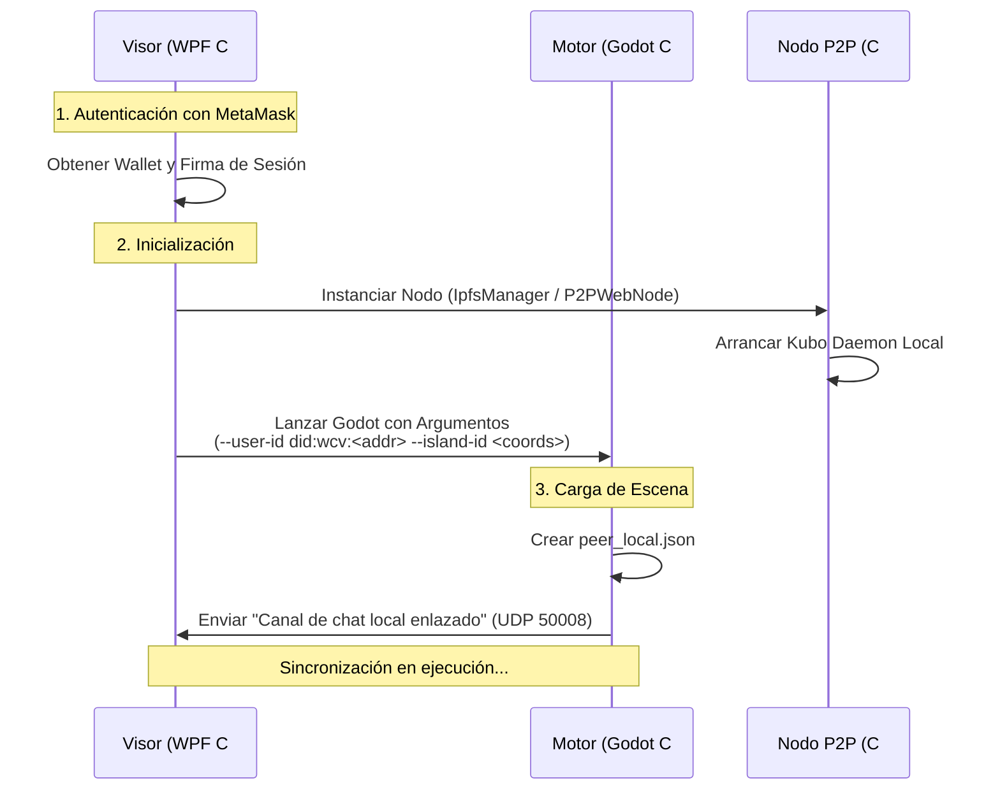
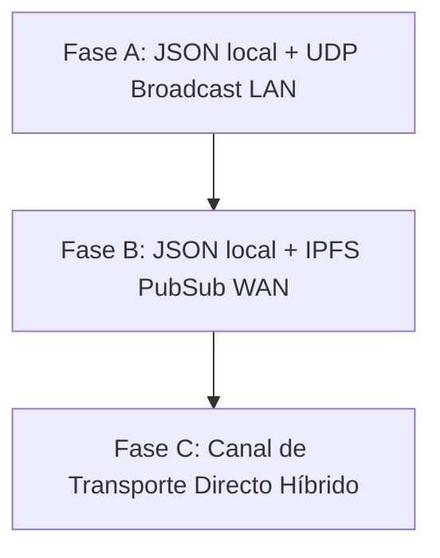

Viewed PeerSyncService.cs:1-331
Searched web: "class IpfsManager"
Searched web: "IpfsManager.cs"
Listed directory CapaVisor3D
Listed directory p2pipfsCS
Viewed IpfsManager.cs:1-381
Viewed PeerSchema.cs:1-155
Viewed P2PWebNode.cs:1-800
Searched web: "StrictHostKeyChecking=no"

I see you’ve approved the implementation plan. To move forward, I need to know which milestone (hito) you’d like to start with:

- **Hito 1:** Seguridad e Higiene del Puente de Red (Prioridad P0) – file‑sanitization, CORS hardening, SSH host‑key validation, security constants, etc.  
- **Hito 2:** Identidad Criptográfica y Firma de Estado (Prioridad P0) – DID generation, state‑payload signing, signature verification.  
- **Hito 3:** Contratos y Desacoplamiento de Red (Prioridad P1) – consolidate Godot sync scripts, clean up `NetworkLayer.gd`/`IslandStateSync.gd`.  
- **Hito 4:** Transporte IPFS PubSub WAN (Prioridad P2) – replace UDP broadcast with IPFS PubSub, add adapter, performance tests.

Please let me know which one you’d like to begin with (or if you’d prefer a different ordering). Once I have your choice, I’ll start applying the corresponding code changes.

# Especificación Arquitectónica y Plan de Desarrollo - DevAntigravityIA

**Fecha de análisis:** 2026-06-28  
**Rama activa:** DevAntigravityIA  
**Rol:** Arquitectura, Contratos Técnicos, Seguridad y Sincronización del Metaverso P2P  
**Proyecto:** WoldVirtual P2P 3D  

---

## 1. Diagnóstico del Estado del Directorio (Arquitectura de Red y Sincronización)

Tras investigar la estructura y el código actual en `D:\WCVcoinMTB`, se determina que el proyecto cuenta con un prototipo funcional local sumamente interesante, pero presenta limitaciones de diseño y seguridad que deben resolverse para la fase productiva.

### Hallazgos Clave de la Investigación:
1. **Doble Implementación en Godot (GDScript):** Existen dos scripts encargados de la sincronización local: `NetworkLayer.gd` y `IslandStateSync.gd`.
   - `NetworkLayer.gd` es cargado dinámicamente por el `ChunkManager.gd`.
   - `IslandStateSync.gd` está instanciado físicamente en la escena `N3DWoldVirtualMT.tscn` pero no se utiliza activamente para mover jugadores.
   - Ambos scripts operan de manera similar: escanean `Estado_Global/peers/` y leen/escriben archivos `peer_*.json`. Esto genera redundancia y confusión sobre cuál es la fuente de verdad.
2. **Sincronización P2P Limitada (LAN-only):** La clase C# `PeerSyncService.cs` propaga los estados de los avatares a través de **UDP Broadcast en el puerto 50099**. Esto limita la sincronización en tiempo real únicamente a la red de área local (LAN).
3. **Distribución del Visor sobre Túneles/IPFS:** La clase C# `P2PWebNode.cs` maneja la empaquetación del visor (`visor.zip`) y su distribución remota a través de túneles efímeros (Cloudflare, Serveo) y el daemon IPFS local (Kubo). Sin embargo, esta capa distribuye los *assets estáticos*, pero **no sincroniza el estado dinámico (posiciones/chat)** de los avatares en la WAN.
4. **Ausencia de Validación Criptográfica de Identidad:** Los archivos de peer (`peer_<id>.json`) no contienen firmas digitales. Cualquier nodo local puede falsificar el archivo de otro jugador (ID spoofing) e inyectar coordenadas falsas, lo que compromete por completo la seguridad y la consistencia del estado del metaverso.
5. **Políticas de Seguridad de Red Laxas:**
   - La API de Kubo IPFS se configura con CORS `*`.
   - Los ejecutables auxiliares (`cloudflared.exe` y Kubo) se descargan de internet en caliente sin comprobar firmas criptográficas o hashes fijos.
   - El túnel SSH reverso usa `StrictHostKeyChecking=no` sin validar claves de host específicas.

---

## 2. Contratos Técnicos de la Nueva Arquitectura

Para resolver las deficiencias identificadas, definimos los siguientes contratos y especificaciones técnicas:

### Contrato A: Identidad Única de Nodo (DID) y Persistencia

Para evitar la suplantación de identidad y habilitar la confianza descentralizada, sustituiremos los IDs locales generados al azar por un Identificador Descentralizado (DID) vinculado a la wallet cripto del usuario.

1. **Estructura del DID:** `did:wcv:<eth_address_lower>`
   - Ejemplo: `did:wcv:0x71c7656ec7ab88b098defb751b7401b5f6d8976f`
2. **Llaves Asociadas:**
   - **Clave Pública:** La dirección de la wallet sirve como clave pública de identidad.
   - **Clave Privada:** Se utiliza la clave privada de la wallet del usuario (o una subclave derivada localmente y firmada por la wallet) para firmar criptográficamente cada actualización de estado.
3. **Persistencia de la Identidad:**
   - Se elimina `current_user.json` del repositorio versionado de Git.
   - Los datos de sesión e identidad se almacenarán en la carpeta de datos de aplicación local del usuario (`%LocalAppData%/WoldVirtualP2P/session/identity.json`), protegidos con encriptación a nivel de sistema operativo (DPAPI en Windows).
   - Formato de persistencia local (`identity.json`):
     ```json
     {
       "did": "did:wcv:0x71c7656ec7ab88b098defb751b7401b5f6d8976f",
       "username": "SantuarioSoberano",
       "derivedPublicKey": "04b2a3...",
       "encryptedDerivedPrivateKey": "a98f12...",
       "lastLogin": "2026-06-28T11:32:00Z"
     }
     ```

### Contrato B: Handshake entre Visor (WPF), Nodo (P2P/IPFS) y Motor (Godot)

El flujo de inicio y emparejamiento de los tres componentes debe ser secuencial y estrictamente verificado:



#### Especificación de Puertos y Protocolos Internos:
- **UDP 50007 (WPF -> Godot):** Transmite mensajes de chat entrantes de la red global y eventos de voz (VAD) detectados en el visor.
- **UDP 50008 (Godot -> WPF):** Transmite chat escrito por el usuario en el mundo 3D y estados de inicialización del motor.
- **Carpeta Estado_Global/peers/ (Puente de Estado):** Godot escribe su estado local en esta carpeta y lee los archivos de los peers remotos. La aplicación C# observa cambios en esta carpeta y se encarga de enviarlos a la red, y viceversa.

---

## 3. Modelo de Confianza y Validación entre Peers

Cada archivo `peer_<did_hash>.json` que se reciba del exterior (ya sea por LAN o WAN) debe pasar por un pipeline de validación antes de ser copiado a la carpeta de estado de Godot.

1. **Esquema de Datos Requerido (JSON Schema):**
   ```json
   {
     "$schema": "http://json-schema.org/draft-07/schema#",
     "type": "object",
     "required": ["did", "seq", "ts", "state", "sig"],
     "properties": {
       "did": { "type": "string", "pattern": "^did:wcv:0x[a-fA-F0-9]{40}$" },
       "seq": { "type": "integer", "minimum": 0 },
       "ts": { "type": "string", "format": "date-time" },
       "state": {
         "type": "object",
         "required": ["u", "i"],
         "properties": {
           "u": { "type": "object" },
           "i": { "type": "object" }
         }
       },
       "sig": { "type": "string", "description": "Firma ECDSA (secp256k1) del hash de (did + seq + ts + state)" }
     }
   }
   ```
2. **Pipeline de Validación en C# (Antes de escribir en Disco):**
   - **Paso 1: Sanitización del Path.** Validar que el nombre del archivo cumpla con la expresión regular `^peer_did_wcv_0x[a-fA-F0-9]{40}\.json$`. Si contiene caracteres como `/` o `\`, rechazar inmediatamente (mitigación de Path Traversal).
   - **Paso 2: Validación de Firma.** Recuperar la dirección Ethereum a partir de la firma `sig` y el contenido del JSON. Validar que coincida exactamente con el `did` especificado en el payload.
   - **Paso 3: Monotonía del Mensaje.** Comparar el número de secuencia `seq` y la marca de tiempo `ts` con el estado previo almacenado en caché. Si el mensaje es antiguo o está duplicado (Replay Attack), se descarta de inmediato.
   - **Paso 4: Cuota de Disco.** Restringir el tamaño máximo de cada archivo de peer a **64 KB**. Limitar el número máximo de peers almacenados concurrentemente en disco a **100**.

---

## 4. Evolución de la Sincronización: De JSON Local a IPFS PubSub (WAN)

El sistema de archivos local (`peer_*.json`) es ideal como puente de memoria entre C# y Godot, pero el transporte por UDP Broadcast LAN debe evolucionar para soportar el metaverso distribuido a través de internet (WAN).

### Diseño de la Transición en 3 Fases:



#### Fase A: Estado Actual (LAN Híbrido)
- Godot escribe un JSON local.
- WPF (`PeerSyncService.cs`) detecta la escritura en disco.
- WPF difunde el archivo completo mediante UDP Broadcast en la red LAN.
- Los nodos vecinos reciben el paquete y lo escriben en su carpeta `peers/`. Godot detecta el cambio e integra el avatar.

#### Fase B: Estado Intermedio (IPFS PubSub WAN)
- Mantendremos la interfaz de disco (`peer_*.json`) en Godot y WPF para no alterar el código de Godot.
- Reemplazaremos el transporte de `PeerSyncService.cs`. En lugar de UDP Broadcast, WPF utilizará la API PubSub de Kubo IPFS (utilizando el comando `ipfs pubsub pub/sub`).
- Todos los nodos del metaverso se suscriben al topic global `/wcv/metaverse/state/v1`.
- Al actualizarse el estado local, C# publica el JSON firmado en el topic de IPFS PubSub.
- Kubo IPFS distribuye el mensaje a nivel mundial utilizando Gossipsub a través de sus relays. Los receptores validan la firma y escriben el JSON en la carpeta de peers de su nodo.
- **Resultado:** ¡Sincronización multiusuario global en la WAN sin cambiar una sola línea de código en Godot!

#### Fase C: Canal Directo (Movimiento de Alta Frecuencia)
- IPFS PubSub es óptimo para chat, islas estáticas y presencia, pero puede tener demasiada latencia para el movimiento de los avatares (posiciones x, y, z en tiempo real).
- Se introducirá un canal directo P2P sobre WebRTC o WebSockets aprovechando los túneles activos de `P2PWebNode.cs`. Los metadatos de conexión se intercambiarán mediante IPFS PubSub (señalización) y el tráfico de posición fluirá de forma directa y optimizada entre avatares cercanos.

---

## 5. Criterios de Consistencia, Bootstrap y Recuperación

### Bootstrap (Arranque de Nodo):
1. **Conexión al Enjambre:** El nodo arranca `IpfsManager.cs` y se conecta a los Bootstrap Peers predefinidos de WCV.
2. **Descarga de Catálogos (Islas):** El nodo consulta en el DHT los CIDs de las islas existentes y recupera el mapa inicial.
3. **Suscripción en Tiempo Real:** El nodo se une al topic PubSub para comenzar a recibir la posición de los avatares dinámicos en línea.

### Consistencia de Conflictos:
- **Estados Dinámicos (Avatares):** Se aplica la regla de *Last Write Wins* (LWW) basada en el timestamp `ts` firmado.
- **Estados Estáticos (Islas/Assets):** Cada isla pertenece a un dueño único (`owner_did`). Solo se aceptan actualizaciones de la isla `island_X` si están firmadas por el DID del propietario legítimo.

### Recuperación ante Caídas:
- Si el daemon de IPFS se cae, `IpfsManager.cs` detectará la pérdida del latido de la API (`/api/v0/id`) y reiniciará el proceso automáticamente en un plazo de 5 segundos.
- Si un túnel SSH reverso se interrumpe, `P2PWebNode.cs` intentará reconectarse utilizando un algoritmo de backoff exponencial (1s, 2s, 4s, 8s... hasta un máximo de 30s).

---

## 6. Seguridad del Nodo P2P y de IPFS Auxiliar

Para mitigar los vectores de ataque en `P2PWebNode.cs` e `IpfsManager.cs`, se establecen las siguientes medidas correctivas obligatorias:

1. **Restricción de CORS en IPFS Kubo:**
   - Cambiar la configuración de `Addresses.API` para escuchar únicamente en localhost (`127.0.0.1`).
   - Modificar los headers de CORS para restringir el acceso exclusivo al puerto del Visor C# y el entorno local:
     ```bash
     ipfs config --json API.HTTPHeaders.Access-Control-Allow-Origin '["http://127.0.0.1:8082", "http://localhost:8082"]'
     ```
2. **Integridad de Binarios Externos:**
   - La descarga de `cloudflared.exe` e `ipfs.exe` debe ser verificada contra una lista blanca de hashes SHA256 estáticos en la aplicación. Si el hash del archivo descargado no coincide, el nodo debe rechazar la ejecución por seguridad.
3. **Endurecimiento de SSH:**
   - Eliminar `StrictHostKeyChecking=no`.
   - Incluir la huella digital (host key fingerprint) de los servidores oficiales de túnel (como serveo.net) dentro del código C# para prevenir ataques de Man-in-the-Middle (MitM) durante el reenvío de puertos.

---

## 7. Plan de Trabajo DevAntigravityIA: Prioridades y Backlog

### Hito 1: Seguridad e Higiene del Puente de Red (Prioridad P0)
- [ ] Eliminar `current_user.json` y los estados `peer_*.json` de la caché de Git (En coordinación con `DevCodexIA`).
- [ ] Implementar la sanitización estricta del nombre de archivo de peers en `PeerSyncService.cs` y `IslandStateManager.cs` para evitar Path Traversal.
- [ ] Restringir CORS de la API Kubo IPFS a localhost.

### Hito 2: Identidad Criptográfica y Firma de Estado (Prioridad P0)
- [ ] Integrar validación de firmas de wallets en el Visor WPF antes de habilitar la sesión de Godot.
- [ ] Crear el pipeline de firma ECDSA para el JSON del estado del avatar local en WPF.
- [ ] Crear el verificador de firmas y validador de marcas de tiempo en el lado del receptor.

### Hito 3: Contratos y Desacoplamiento de Red (Prioridad P1)
- [ ] Limpiar la redundancia de scripts en Godot: Unificar la lógica de lectura/escritura únicamente en `NetworkLayer.gd` y eliminar o desactivar `IslandStateSync.gd` de la escena principal para evitar escrituras en bucle.
- [ ] Definir el esquema JSON formalizado de peer en un archivo de configuración tipado compartido.

### Hito 4: Transporte IPFS PubSub WAN (Prioridad P2)
- [ ] Diseñar el adaptador PubSub en `PeerSyncService.cs` utilizando comandos CLI o llamadas HTTP API de Kubo.
- [ ] Implementar la suscripción y publicación de estados a través de la red WAN de IPFS.
- [ ] Validar rendimiento y latencia en entornos simulados de red débil.
