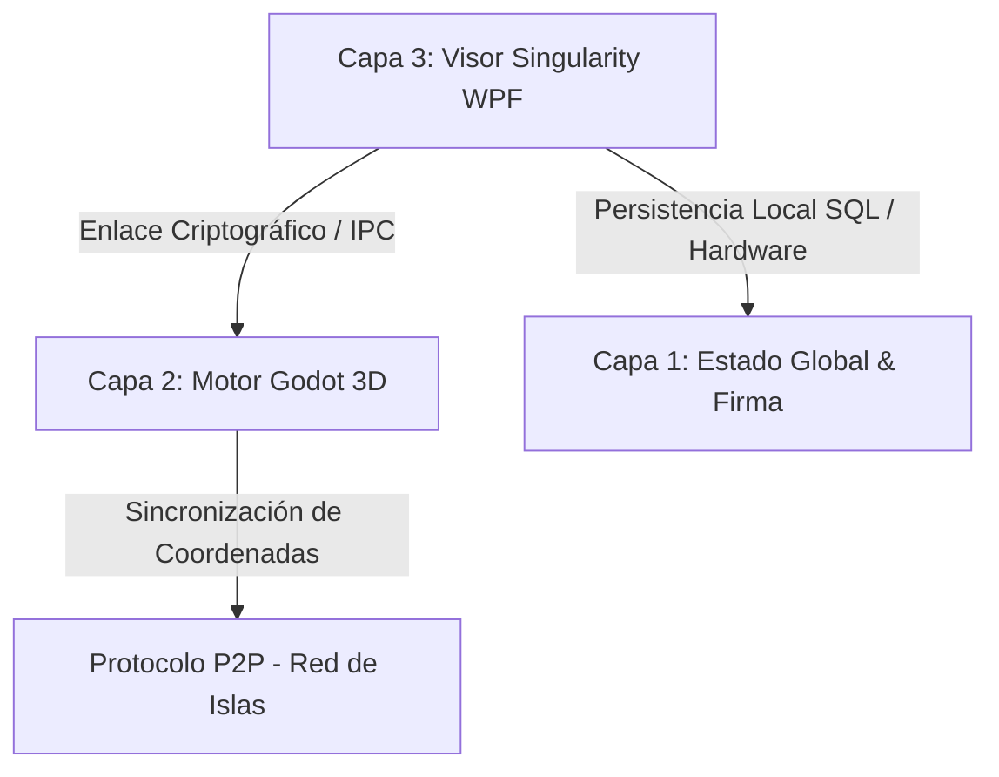

# ⬢ WoldVirtual P2P 3D — Metaverso Cripto Descentralizado

> **🎯 Estado del Proyecto:** Prototipo Funcional de Alta Fidelidad y Visor Estético Completado.
> Integración fluida del motor 3D de Godot incrustado en un visor WPF moderno y descentralizado de 3 Capas.

---

## 🔍 Arquitectura de 3 Capas Implementada

La arquitectura actual del proyecto conecta de forma segura el motor de renderizado 3D, la lógica de red local P2P y la persistencia criptográfica en el sistema de la siguiente manera:

1. **Capa 1: Persistencia y Firma (Estado Global):**
   * **Base de Datos SQLite:** Almacenamiento local seguro de identidades vinculadas a firmas de hardware.
   * **Criptografía de Hardware (Fingerprint):** Algoritmo de hash SHA-256 generado a partir de IDs únicos de CPU, Placa Base y Sistema Operativo obtenidos mediante WMI.
   * **Firma Digital Cuántica:** Exportación e importación segura de claves en un paquete `.zip` comprimido que resguarda la llave cuántica local.

2. **Capa 2: Motor Gráfico (Godot Engine):**
   * **Godot 4.6.2 Stable (Mono / C# / OpenGL3):** Renderizado en caliente embebido directamente mediante controladores nativos.
   * **Lógica del Mundo P2P:** Teletransporte P2P, gestión de físicas del avatar, renderizado de islas y shaders integrados.

3. **Capa 3: Visor Singularity (WPF / .NET 8):**
   * **Flujo del Wizard en 4 Pasos:** Registro guiado, generación automática de firma, validación de MetaMask y asignación de coordenadas de islas.
   * **Puente HTTP Local (Puerto 8080):** Pasarela de comunicación segura que intercepta la firma de MetaMask desde el navegador para transferirla directamente al Visor WPF.

---

## 🚀 Logros y Hitos Completados

### 💎 Rediseño Estético desde Cero del Visor WPF (`MainWindow.xaml`)
Se ha implementado una interfaz visual de altísima calidad inspirada en la estética cyberpunk e interfaces tácticas de ciencia ficción:
* **Glow & Glassmorphism:** Paneles de cristal esmerilado con fondo translúcido, bordes cian sutiles y efectos de resplandor mediante sombras difusas de neón.
* **Control Chrome Personalizado:** Ventana fija sin barra nativa de Windows (`WindowStyle="None"`) con controles minimalistas de Minimizar y Cerrar con respuestas visuales interactivas.
* **Visuales y Inputs Premium:** Campos de entrada iluminados con transiciones de color en hover/foco y botones de acción dinámicos en neón cian, verde esmeralda y magenta.
* **HTTP Bridge Wait Overlay:** Alerta premium de validación de MetaMask con barra animada que pulsa de forma infinita mientras escucha el puerto local.

### 🎮 Integración Total de Godot e Inmersión del Viewport 3D
* **Solución de Vibración del Avatar:** Fijación del visor nativo a coordenadas exactas y estiramiento por GPU, eliminando la vibración causada por recálculos en el `HwndHost`.
* **Modo Inmersivo 100%:** Al arrancar el metaverso, el viewport se expande ocupando el 100% de la ventana (`Grid.RowSpan="3"`, `Panel.ZIndex="99"`, `Stretch`).
* **Visualización Perfecta de Godot UI:** El panel interno de Godot ("RED P2P") y sus menús superiores ya no se solapan con barras laterales de WPF.
* **Desacoplamiento de Cierre Seguro:** Implementación de la bandera `_ignoreGodotExit` que previene que WPF aborte el proceso global al apagar Godot durante el teletransporte.

### 🕸️ Capa de Red P2P e Intercambio Autónomo de Visores ✅
Hemos establecido las bases del protocolo descentralizado mediante un sistema P2P directo entre clientes:
* **Nodos IPFS Simulados (`www.NDxxxxx.ipfs`):** Cada usuario que inicia sesión se registra como un nodo autónomo con un dominio IPFS simulado, sirviendo una landing page de invitación en un puerto local dinámico (ej. `http://127.0.0.1:8082/`).
* **Compresión Inteligente con Caché de Godot (`.godot`):** Resolvimos el problema del "mar vacío" incluyendo el directorio `.godot/imported/` en la compresión en segundo plano del `.zip`, asegurando que modelos de islas y avatares se rendericen instantáneamente al compartir el visor.
* **Interfaz de Control Integrada:** Panel de estado glassmorphism en la esquina izquierda-centro del visor 3D para copiar el enlace del nodo sin interrumpir la inmersión.
* **Recuperación Automática de Foco:** Corrección del desvío de teclas en WPF, devolviendo el foco nativo al HWND de Godot al enviar mensajes en el Chat de Proximidad.

---

## ☀️ Verano de IAs: Roadmap Estratégico de Desarrollo (Core P2P)

> **Período:** 25 de junio al 31 de agosto **(67 días de desarrollo intensivo)**
> **Capacidad:** 4 horas/día = **268 horas totales**
>
> **Metodología AI-Assisted:** 67 horas dedicadas a cada agente (**Antigravity, Cursor, Trae, VS Code**), maximizando el paralelismo cognitivo para construir la infraestructura de red descentralizada del metaverso.

---

### 📅 Fase 1: Criptografía de Hardware, Identidad y Sockets Base
**Días 1 a 20 · Prioridad: 🔴 Crítica**

**Objetivo Maestro:** Establecimiento de la capa de transporte segura y generación de identidades únicas irrefutables vinculadas al hardware físico, fundamentales para la soberanía del usuario en un metaverso DeFi.

**🏆 Hito Técnico:** Dos nodos pueden descubrirse mutuamente en la red local e intercambiar un handshake criptográfico sin depender de servidores DNS o intermediarios centrales, garantizando una verdadera descentralización.

#### Distribución del Flujo de Trabajo (4 h/día)

| Hora | Agente | Tarea |
|------|--------|-------|
| ⏱️ H1 | **Antigravity** — Arquitectura & Diseño | Análisis algorítmico de modelos de Hash. Diseño del esquema de seguridad (SHA-256 + Salts aleatorios) para extraer IDs de hardware (CPU, Placa Base, OS) garantizando colisiones nulas. Arquitectura "zero-trust" y DID (Decentralized Identity) para soberanía del usuario con resistencia a computación cuántica. |
| ⏱️ H2 | **Cursor** — Desarrollo Core C# | Implementación de `HardwareFingerprint.cs`. Consultas WMI seguras y serialización para encapsular la firma digital en paquetes `.zip` encriptados. Shamir's Secret Sharing para almacenamiento seguro de claves privadas y rotación de claves en entorno aislado. |
| ⏱️ H3 | **Trae** — Implementación de Red | Servidor TCP/IP asíncrono con `TcpListener`. Pools de hilos de alto rendimiento y rutinas de heartbeat para mantener vivos los sockets P2P ante desconexiones súbitas. Cifrado extremo a extremo y autenticación mutua anti-MITM. |
| ⏱️ H4 | **VS Code** — QA, Refactor & Testing | Smoke testing con instancias múltiples en loopback `127.0.0.1`. Validación de persistencia SQLite, ausencia de fugas de sockets y auditorías periódicas de seguridad con fuzzing. |

> **📦 Entregable:** Librería Core P2P que permite conectar dos Visores Singularity directamente de igual a igual y validar la sesión mediante firmas digitales, sentando las bases para una economía digital segura.

---

### 📅 Fase 2: Motor de Tráfico, Throttling y Distribución Descentralizada
**Días 21 a 40 · Prioridad: 🟠 Alta**

**Objetivo Maestro:** Implementación del sistema de distribución de archivos (file-sharing P2P) con control estricto de recursos físicos del jugador, crucial para la sostenibilidad y equidad en un metaverso DeFi.

**🏆 Hito Técnico:** Capacidad de compartir el cliente/visor (`.zip` del juego base) y los assets 3D de las islas sin superar jamás el límite hard-coded de **300 MB de subida por nodo**, optimizando el uso de recursos de red.

#### Distribución del Flujo de Trabajo (4 h/día)

| Hora | Agente | Tarea |
|------|--------|-------|
| ⏱️ H1 | **Antigravity** — Arquitectura & Diseño | Diseño del algoritmo **Token Bucket / Leaky Bucket** para la modelación del ancho de banda. Análisis de fragmentación óptima de paquetes y prevención de interbloqueos en congestiones domésticas. Resistencia a DoS/DDoS con acceso equitativo a la red. |
| ⏱️ H2 | **Cursor** — Desarrollo Core C# | Motor de transferencia por chunks asíncronos en RAM. Limitadores de subida con `Task.Delay` dinámicos calibrando bytes/segundo en tiempo real. Checksums criptográficos y mecanismos de retransmisión robustos. |
| ⏱️ H3 | **Trae** — Implementación de Red | Gestión multiplexada de conexiones masivas concurrentes. Distribución matemáticamente justa del ancho de banda entre múltiples pares simultáneos (máx. 30 MB por conexión si hay 10 usuarios). CDN descentralizadas para activos populares. |
| ⏱️ H4 | **VS Code** — QA, Refactor & Testing | Profiling de estrés con altas latencias simuladas. Monitoreo automatizado para certificar (frente al Administrador de Tareas de Windows) que el consumo de ancho de banda jamás supera el umbral máximo. |

> **📦 Entregable:** Motor de transferencia modular estilo "BitTorrent encriptado privado", asegurando que el instalador de WoldVirtual se auto-distribuya de forma viral, sostenible y descentralizada.

---

### 📅 Fase 3: Estado Global, Sincronización JSON y "Cero Absoluto"
**Días 41 a 60 · Prioridad: 🟡 Media-Alta**

**Objetivo Maestro:** Sincronización descentralizada del estado universal del metaverso (miles de islas generadas) garantizando la consistencia eventual sin servidores centrales, esencial para la interoperabilidad y confianza en un entorno DeFi.

**🏆 Hito Técnico:** Todo nodo es capaz de asimilar, fusionar y persistir su archivo `estado_metaverso.json` maestro de forma atómica, sin pisarse con los avances de otros jugadores en la red.

#### Distribución del Flujo de Trabajo (4 h/día)

| Hora | Agente | Tarea |
|------|--------|-------|
| ⏱️ H1 | **Antigravity** — Arquitectura & Diseño | Modelado estructural de la base de datos JSON con esquemas **CRDT** (Conflict-free Replicated Data Types). Estrategia heurística basada en **Relojes de Lamport** para resolver conflictos si dos jugadores plantan una isla exactamente al mismo tiempo. |
| ⏱️ H2 | **Cursor** — Desarrollo Core C# | Implementación de la directiva del **"Cero Absoluto" (0,0,0)**. Lógica génesis: cuando un nodo arranca sin detectar pares en la red (o pierde contacto total con la DHT), inicia su tabla vacía y genera la coordenada base Génesis de inmediato. Estado génesis inmutable y verificable criptográficamente. |
| ⏱️ H3 | **Trae** — Implementación de Red | **Delta Syncing** (sincronización diferencial extrema). En lugar de enviar el universo completo cada segundo, rutinas de comparación extraen únicamente los registros modificados en los últimos minutos, reduciendo el consumo de red a kilobytes. Firmas digitales en cada delta. |
| ⏱️ H4 | **VS Code** — QA, Refactor & Testing | Simulaciones intensivas de **"Split-brain" (cerebro dividido)**. Aislar intencionadamente dos grupos de nodos, poblar sus redes de islas y reconectarlos para validar la curación automática del estado mediante fusión inteligente del JSON. |

> **📦 Entregable:** Matriz de almacenamiento inmutable y distribuida. Un cosmos virtual cuyo "recuerdo" de todas las construcciones perdurará mientras exista al menos un nodo encendido en la red.

---

### 📅 Fase 4: Integración 3D en Godot, Desacoplamiento y Cierre Open Source
**Días 61 a 67 · Prioridad: 🟢 Lanzamiento**

**Objetivo Maestro:** Enlazar el puente C# P2P asíncrono con el contexto gráfico, el sistema de físicas y el renderizado interno de Godot 4.6.2, asegurando una experiencia de usuario fluida en el metaverso DeFi sin pérdida de FPS.

**🏆 Hito Técnico:** Representar visualmente las transacciones P2P en pantalla 3D; cada avatar e isla reacciona instantáneamente al paso de paquetes TCP/UDP sin causar Stuttering ni caída de FPS.

#### Distribución del Flujo de Trabajo (4 h/día)

| Hora | Agente | Tarea |
|------|--------|-------|
| ⏱️ H1 | **Antigravity** — Arquitectura & Diseño | Profiling final de paralelismo multihilo. Extirpación de Deadlocks en la comunicación IPC entre el entorno WPF (.NET 8) y la instancia nativa de Godot. Mecanismos de IPC seguros y auditables; interacción blockchain-motor 3D atómica y resistente a fallos. |
| ⏱️ H2 | **Cursor** — Desarrollo Core C# | Transpositor universal de coordenadas espaciales: `Posición Real = Eje Isla Macro + Posición Avatar Micro`. Refactorización con `double precision` para prevenir colapsos de cálculo flotante en los límites del metaverso. Validación de límites y rangos en todas las operaciones espaciales. |
| ⏱️ H3 | **Trae** — Implementación de Red | **Co-Seeding predictivo de assets** (modelos, texturas). El nodo inteligente precarga fragmentos de mapa en segundo plano extrapolando el trayecto del avatar, logrando cero pantallas de carga. Verificación criptográfica de activos precargados para prevenir inyección maliciosa. |
| ⏱️ H4 | **VS Code** — QA, Refactor & Testing | Pulido terminal del árbol de ramas en GitHub. Incorporación integral de XML Docs en interfaces C# y linting general. Cierre absoluto de incidencias residuales: **0 errores, 0 advertencias en Release**. Documentación técnica pública con especificaciones de seguridad y guía de contribución. |

> **📦 Entregable:** Lanzamiento definitivo **v1.0.0 Alpha** del core distribuido WoldVirtual; un ecosistema documentado, seguro y abierto, capacitado para que cualquier usuario instale la semilla tecnológica y propague el juego libremente.

---

## 📊 Resumen Ejecutivo del Roadmap

| Fase | Período | Agentes | Entregable Clave |
|------|---------|---------|-----------------|
| 🔴 Fase 1 | Días 1–20 | Antigravity / Cursor / Trae / VS Code | Librería Core P2P + Handshake Criptográfico |
| 🟠 Fase 2 | Días 21–40 | Antigravity / Cursor / Trae / VS Code | Motor BitTorrent Encriptado + Throttling 300 MB |
| 🟡 Fase 3 | Días 41–60 | Antigravity / Cursor / Trae / VS Code | Estado Global CRDT + Delta Sync + Génesis |
| 🟢 Fase 4 | Días 61–67 | Antigravity / Cursor / Trae / VS Code | v1.0.0 Alpha Open Source |

---

## 📋 Sesión Actual — Rama: `DevAntigravityIA`

**📅 Última sesión: 21 de mayo de 2026**

### ✅ Completado en esta sesión
- **Panel P2P Reposicionado:** El overlay flotante del nodo P2P (`P2PWebNodePopup`) se posiciona ahora dentro del visor 3D en la esquina izquierda-centro (`HorizontalOffset=330`, `VerticalOffset=10`), visible sin interrumpir la inmersión.
- **ZIP con Caché de Godot:** Resuelto el error del "mar vacío" en el segundo nodo incluyendo `.godot/imported/` en el ZIP de distribución.
- **Compilación limpia:** `dotnet build` → `0 Errores`, `0 Advertencias`.

### 🔧 Rama paralela: `DevTraeIA` (estado conocido)
En la sesión paralela de Trae se trabajó el sistema de cierre de sesión del visor WPF anterior (botón "CERRAR SESIÓN"). Los hallazgos clave fueron:
- El botón estaba correctamente vinculado en XAML (`Click="BtnCerrarSesion_Click"`) ✅
- El panel `PanLeftSidebar` tenía `Visibility="Collapsed"` por defecto ⚠️
- **Hipótesis H6 confirmada:** El panel se ocultaba antes de que el evento click completara su ejecución.
- **Solución aplicada:** Uso de `Dispatcher.BeginInvoke` con prioridad `Background` para retrasar la ocultación del panel hasta que el evento finalizara por completo.

---

*Generado y mantenido con asistencia de IA — WoldVirtual P2P 3D · 2026*