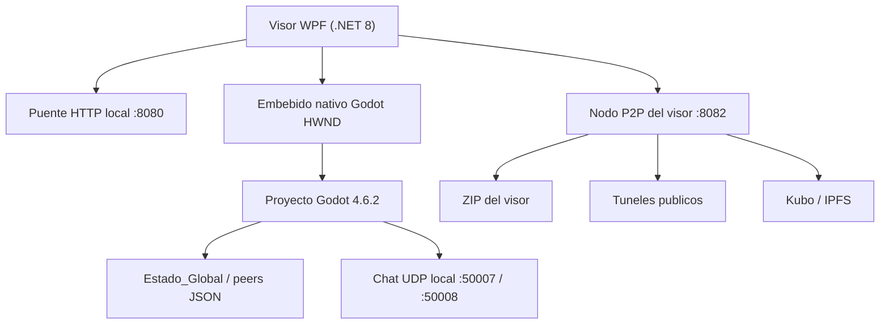

# WoldVirtual P2P 3D

Metaverso 3D experimental para Windows que combina un visor WPF en .NET 8, un proyecto Godot 4.6.2 embebido y un sistema de sincronizacion P2P basado en archivos JSON, UDP local y distribucion del visor por ZIP, tuneles publicos e IPFS.

> Estado actual del repositorio: prototipo funcional local, sin CI ni tests automatizados, con build WPF verificada el 23 de mayo de 2026.

---

## Resumen ejecutivo

Hoy el repositorio implementa estas piezas reales:

- Un wizard de entrada en WPF que genera una huella SHA-256 del hardware, permite guardar un ZIP de respaldo y conduce al usuario hacia la vinculacion de wallet.
- Un puente HTTP local en `http://localhost:8080/` que sirve `metamask.html`, recoge la firma del navegador y lanza el motor Godot embebido.
- Un embebido nativo de Godot dentro del visor WPF usando `HwndHost`.
- Un mundo 3D en Godot con avatar local/remoto, islas activas, HUD de wallet, chat local por UDP y panel lateral de teletransporte.
- Un nodo P2P del visor (`P2PWebNode`) que comprime el repo, lo sirve en local por HTTP, intenta exponerlo por tunel publico y puede apoyarse en Kubo/IPFS.
- Un sistema de estado global en `WoldVirtual/Estado_Global` con clases C# y sincronizacion por peers JSON desde Godot.

Tambien queda reflejado el ajuste mas reciente del repo:

- La barra `P2PNodeBar` del visor WPF vuelve a estar fija arriba a la derecha y ya no depende de superponerse sobre el area embebida de Godot.

---

## Arquitectura real del repo



### Capa 1: Visor WPF

Ruta principal:

- `Capa3_Visor/CapaVisor3D/MainWindow.xaml`
- `Capa3_Visor/CapaVisor3D/MainWindow.xaml.cs`
- `Capa3_Visor/CapaVisor3D/GodotHwndHost.cs`

Responsabilidades actuales:

- Escaneo de hardware por WMI.
- Generacion de fingerprint SHA-256.
- Exportacion de respaldo ZIP del registro local.
- Registro de usuario y transicion visual entre pantallas.
- Lanzamiento del navegador para MetaMask.
- Arranque del binario Godot incluido en el repo.
- Reenvio de teclado al avatar embebido.
- Chat de proximidad WPF por UDP.
- Barra superior `P2PNodeBar` con estado del nodo del visor.

### Capa 2: Proyecto Godot

Ruta principal:

- `WoldVirtual/project.godot`
- `WoldVirtual/EscenaPrincipal.tscn`
- `WoldVirtual/woldvirtual/scene/MTC/N3DWoldVirtualMT.tscn`

Responsabilidades actuales:

- Registro de avatar local en `RegistroAV.tscn`.
- Mundo 3D principal con chunk base, oceano, cielo, iluminacion y avatar.
- UI lateral de islas activas (`TeleportUI.gd`).
- HUD superior derecho de wallet y balance (`WalletUI.gd`).
- Chat local con burbujas 3D sobre avatars (`ChatUI.gd` + `userbase3d.gd`).
- ECS interno para interpolacion, salida de red y visibilidad.

### Capa 3: Estado global y sincronizacion

Rutas principales:

- `WoldVirtual/Estado_Global/`
- `WoldVirtual/woldvirtual/gdscrip/NetworkLayer.gd`
- `WoldVirtual/woldvirtual/gdscrip/IslandStateSync.gd`

Responsabilidades actuales:

- Persistencia de peers en `Estado_Global/peers`.
- Fusion de estados por archivo JSON.
- Gestion de sesion e islas en C#.
- Version antigua y version actual de sincronizacion coexistiendo en el repo.

---

## Flujo real de ejecucion

1. El visor WPF arranca en `GridPcRegistration`.
2. Se ejecuta un escaneo WMI del equipo y se calcula una firma SHA-256.
3. El usuario puede guardar un respaldo ZIP con `registro_hardware.txt` y `signature.key`.
4. Se habilita el paso de registro de usuario en WPF.
5. El visor levanta `HttpListener` en `localhost:8080` y abre el navegador con `www/metamask.html`.
6. El navegador solicita cuenta MetaMask y firma, con fallback simulado si MetaMask no existe.
7. El callback `/confirm` cierra el bridge, muestra `GridMainViewer` y lanza Godot con argumentos:

```text
--wallet
--user-id
--island-id
```

8. WPF localiza la ventana del proceso Godot, la incrusta en el `GodotPlaceholder` y redirige teclado.
9. Godot registra el usuario en `current_user.json`, carga `N3DWoldVirtualMT.tscn` y activa UI/estado.
10. WPF inicia el listener UDP del chat y el nodo P2P del visor.

---

## Estado funcional por modulo

### WPF / launcher

| Modulo | Estado | Notas |
|---|---|---|
| `MainWindow.xaml.cs` | Activo | Orquesta wizard, MetaMask, Godot, chat y barra P2P |
| `GodotHwndHost.cs` | Activo | Embebido Win32 del motor Godot dentro de WPF |
| `www/metamask.html` | Activo | Flujo visual de firma y fallback simulado |
| Build `dotnet build` | Verificada | Compilo bien el 23 de mayo de 2026 |

### Godot / mundo 3D

| Modulo | Estado | Notas |
|---|---|---|
| `RegistroAV.gd` | Activo | Guarda `username`, `gender`, `wallet` y cambia de escena |
| `ChunkManager.gd` | Activo | Inyecta `NetworkLayer`, `WorldManager`, `AvatarController` y ECS |
| `WorldManager.gd` | Activo | Spawnea islas y usuarios, limpia ghost islands, asigna slots |
| `userbase3d.gd` | Activo | Movimiento local, salto, carrera y burbujas 3D |
| `TeleportUI.gd` | Activo con auto-ocultacion | Se oculta cuando detecta wallet/embebido en WPF |
| `WalletUI.gd` | Activo | Muestra wallet truncada y balance `0.000 WCV` |
| `ChatUI.gd` | Activo y headless | Usa UDP, sin panel propio visible dentro de Godot |
| `EnvironmentManager.gd` | Activo | Tonemapping, SSAO, SSIL, SDFGI y ciclo solar |
| `PerformanceManager.gd` | Activo | Baja/sube calidad segun FPS y reporta VRAM |

### Estado global C#

| Modulo | Estado | Notas |
|---|---|---|
| `GlobalConfig.cs` | Activo | Resuelve rutas dinamicamente |
| `SessionManager.cs` | Activo | Inicia/cierra sesiones y visita de islas |
| `IslandStateManager.cs` | Activo | Vigila `peer_*.json`, fusiona y aplica cuota |
| `QuotaManager.cs` | Activo | Resume RAM/VRAM/almacenamiento del nodo |
| `SharedModels.cs` | Activo | Modelos JSON y source generation |

### P2P del visor / distribucion

| Modulo | Estado | Notas |
|---|---|---|
| `P2PWebNode.cs` | Activo | Sirve landing, ZIP, proxy local y estado a la UI |
| `IpfsManager.cs` | Activo con dependencia externa | Descarga/arranca Kubo si hace falta |
| `IpfsPublisher.cs` | Activo | Publica archivos o directorios por CLI de Kubo |
| `P2PNodeBar` | Activo | Widget WPF fijado arriba a la derecha |

---

## Estado P2P e IPFS hoy

Lo que ya existe de verdad en el codigo:

- HTTP local del nodo del visor en `127.0.0.1:8082`.
- ZIP del repo generado bajo demanda.
- Landing page de descarga servida por el propio nodo.
- Intento de tunel publico con Cloudflare Quick Tunnel y alternativas SSH.
- Integracion con Kubo descargable automaticamente.
- Publicacion por `ipfs add` via CLI.
- Actualizacion visual del estado del nodo en la UI WPF.

Lo que todavia no es un nodo P2P puro de metaverso:

- No hay libp2p nativo implementado dentro del juego.
- No hay descubrimiento de pares del metaverso sobre una DHT propia.
- La sincronizacion principal de avatars/islas sigue basada en archivos JSON locales.
- El reparto de mundo sigue siendo prototipo, no una red publica multijugador validada.

---

## Estructura del repositorio

```text
D:\WCVcoinMTB
├─ Capa3_Visor/
│  └─ CapaVisor3D/
│     ├─ MainWindow.xaml
│     ├─ MainWindow.xaml.cs
│     ├─ GodotHwndHost.cs
│     ├─ VisorSingularity.csproj
│     ├─ www/
│     └─ p2pipfsCS/
├─ WoldVirtual/
│  ├─ project.godot
│  ├─ EscenaPrincipal.tscn
│  ├─ servidorinterno/
│  ├─ Estado_Global/
│  └─ woldvirtual/
├─ IAs/
│  ├─ DevCursorIA/
│  └─ DevTraeIA/
└─ README.md
```

---

## Como compilar y ejecutar

### Requisitos reales

- Windows.
- .NET SDK con soporte para `net8.0-windows`.
- Acceso a WMI para el escaneo de hardware.
- El ejecutable incluido de Godot:
  - `WoldVirtual/servidorinterno/Godot_v4.6.2-stable_mono_win64.exe`

### Compilar el visor

```powershell
dotnet build Capa3_Visor\CapaVisor3D\VisorSingularity.csproj
```

### Ejecutar el visor

```powershell
dotnet run --project Capa3_Visor\CapaVisor3D\VisorSingularity.csproj
```

Alternativamente:

```powershell
Capa3_Visor\CapaVisor3D\bin\Debug\net8.0-windows\VisorSingularity.exe
```

### Puertos usados por el proyecto

| Puerto | Uso |
|---|---|
| `8080` | Bridge HTTP local para MetaMask; tambien gateway Kubo si se activa IPFS |
| `8082` | Nodo local del visor / landing / ZIP |
| `50007` | WPF -> Godot chat UDP |
| `50008` | Godot -> WPF chat UDP |
| `5001` | API local de Kubo/IPFS |

---

## Estado actual de datos persistidos

Archivos observables hoy en el repo:

- `WoldVirtual/Estado_Global/estado.json`: estado base del metaverso.
- `WoldVirtual/Estado_Global/peers/peer_chicook.json`: ejemplo real de peer activo.
- `WoldVirtual/woldvirtual/scene/MTC/users3D/current_user.json`: perfil local actual del usuario.

Esto confirma que el proyecto ya esta usando persistencia local en disco durante el flujo real.

---

## Limitaciones y deuda tecnica visibles

- No hay `*.sln` ni suite de tests automatizados en el repo.
- Hay cadenas con problemas de codificacion en varios archivos heredados.
- Conviven scripts nuevos y scripts legacy para estado/sincronizacion.
- El proyecto esta claramente orientado a Windows; no esta preparado para Linux/macOS.
- La UX de wallet es funcional, pero depende del navegador externo y de un bridge local.
- El P2P del visor ya distribuye el ZIP, pero la sincronizacion del metaverso aun no es una red distribuida completa.

---

## Verano de IAs

Esta hoja de ruta se conserva porque sigue representando la vision estrategica del proyecto, aunque el repositorio actual aun esta en fase de prototipo funcional.

**Periodo objetivo:** verano de desarrollo intensivo.  
**Idea central:** repartir trabajo entre varios entornos/agentes para acelerar el core P2P del metaverso.

### Fase 1: identidad, firma de hardware y sockets base

- Diseñar una identidad fuerte basada en fingerprint de hardware.
- Consolidar la firma SHA-256 y el empaquetado seguro de credenciales.
- Levantar transporte P2P base y handshakes entre nodos.
- Validar persistencia local y limpieza de sockets.

Entornos previstos:

- `Antigravity`: arquitectura y modelo de seguridad.
- `Cursor`: logica core C# de identidad y firma.
- `Trae`: listeners, transporte y heartbeat de red.
- `VS Code`: QA, smoke tests y consolidacion.

### Fase 2: motor de trafico, throttling y distribucion

- Compartir visor y assets sin saturar el ancho de banda del nodo anfitrion.
- Trocear transferencias por chunks.
- Repartir carga entre conexiones simultaneas.
- Medir uso de red real y aplicar cuotas.

Entregable esperado:

- Un motor de transferencia modular capaz de distribuir el cliente y assets de forma sostenible.

### Fase 3: estado global, sincronizacion JSON y cero absoluto

- Sincronizar el estado del metaverso entre nodos sin servidor central.
- Resolver conflictos de estado de islas y usuarios.
- Mantener una coordenada genesis cuando un nodo arranca en solitario.
- Evolucionar hacia deltas ligeros en lugar de snapshots pesados.

Entregable esperado:

- Un estado global distribuido que sobreviva mientras exista al menos un nodo encendido.

### Fase 4: integracion 3D final, desacoplamiento y version alpha

- Acoplar de forma robusta el puente C# P2P con Godot.
- Resolver rendimiento, precision espacial y preload de assets.
- Documentar el proyecto y cerrar incidencias residuales.
- Preparar una alpha abierta del core distribuido.

Entregable esperado:

- Una `v1.0.0 Alpha` del nucleo distribuido de WoldVirtual, documentada y abierta.

---

## Roadmap tecnico inmediato

Los siguientes pasos tienen mas valor practico sobre el estado actual del repo:

1. Separar claramente lo legacy y lo vigente en sincronizacion (`IslandStateSync.gd` vs `NetworkLayer.gd`).
2. Añadir tests de smoke para el launcher WPF y para la serializacion de `Estado_Global`.
3. Formalizar el contrato de datos entre WPF, Godot y peers JSON.
4. Endurecer el flujo P2P del visor y documentar mejor el comportamiento offline/publico.
5. Corregir la codificacion de textos del proyecto para evitar mojibake en UI y documentacion.

---

## Errores pendientes

### Panel IPFS/P2P aparece antes de tiempo en el registro de avatar

Estado observado a fecha `2026-05-23`:

- El panel superior derecho `P2PNodeBar` sigue apareciendo mientras la pantalla de `Registro de Avatar` de Godot aun esta visible.
- El comportamiento esperado definido hoy es distinto: el panel deberia empezar a aparecer justo despues de pulsar el boton `INICIAR SESION`, no antes.
- La incidencia sigue abierta aunque se hicieron varios intentos de retrasar el disparo.

Evidencia visual local:


Resumen de lo intentado hoy:

- Se movio `P2PNodeBar` a la barra superior del visor WPF para estabilizar su posicion arriba a la derecha.
- Se intento retrasar la activacion del panel hasta despues del guardado del avatar.
- Se intento retrasar la activacion hasta una marca de escena lista (`METAVERSE_READY`) emitida por Godot.
- Se cambio despues el disparo para usar una marca mas exacta desde el boton del registro de avatar (`AVATAR_LOGIN_CLICKED`).
- Se forzo `P2PNodeBar.Visibility = Collapsed` al entrar en la fase de registro de avatar para evitar arrastre visual.
- Se eliminaron disparos tempranos residuales de `METAVERSE_READY` en `ChunkManager.gd`.
- Se verifico que las compilaciones alternativas del visor completan correctamente, por lo que el problema actual parece de logica/tiempo de ejecucion o de binario cargado en sesion.

Hipotesis pendientes de confirmar:

- Puede existir un camino adicional de activacion temprana no identificado todavia.
- Puede estar ejecutandose una instancia previa del binario que no refleja el ultimo estado del codigo.
- Puede haber una condicion de carrera entre el embebido de Godot, el cambio de escena y la visibilidad del panel WPF.

Proximo paso recomendado cuando se retome:

1. Instrumentar con trazas visibles y unicas el momento exacto en que se llama a `ActivateMetaverseUi`, `StartP2PWebNode` y `P2PNodeBar.Visibility = Visible`.
2. Confirmar en ejecucion real si la instancia abierta corresponde al ultimo binario compilado.
3. Si el problema persiste, desacoplar por completo la visibilidad del panel de cualquier logica de salida estandar de Godot y activarlo desde un handshake mas determinista.

---

## Nota final

Este README describe el estado real del codigo del repositorio a fecha 23 de mayo de 2026: un prototipo funcional, embebido y distribuible, con una base tecnica interesante pero todavia en transicion entre demo local, sincronizacion por archivos y una vision P2P mas ambiciosa.
