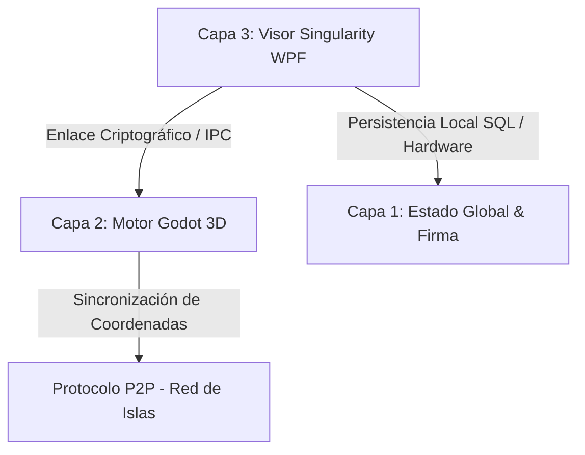

# ⬢ WoldVirtual P2P 3D — Metaverso Cripto Descentralizado

> **🎯 Estado del Proyecto:** Prototipo Funcional de Alta Fidelidad y Visor Estético Completado.
> Integración fluida del motor 3D de Godot incrustado en un visor WPF moderno y descentralizado de 3 Capas.

---

## 🔍 Arquitectura de 3 Capas Implementada

La arquitectura actual del proyecto conecta de forma segura el motor de renderizado 3D, la lógica de red local P2P y la persistencia criptográfica en el sistema de la siguiente manera:

1. **Capa 1: Persistencia y Firma (Estado Global):**
   * **Base de Datos SQLite:** Almacenamiento local seguro de identidades vinculadas a firmas de hardware.
   * **Criptografía de Hardware (Fingerprint):** Algoritmo de hash SHA-256 generado a partir de IDs únicos de CPU, Placa Base y Sistema Operativo obtenidos mediante WMI.
   * **Firma Digital Cuántica:** Exportación e importación segura de claves en un paquete `.zip` comprimido que resguarda la llave cuántica local.

2. **Capa 2: Motor Gráfico (Godot Engine):**
   * **Godot 4.6.2 Stable (Mono / C# / OpenGL3):** Renderizado en caliente embebido directamente mediante controladores nativos.
   * **Lógica del Mundo P2P:** Teletransporte P2P, gestión de físicas del avatar, renderizado de islas y shaders integrados.

3. **Capa 3: Visor Singularity (WPF / .NET 8):**
   * **Flujo del Wizard en 4 Pasos:** Registro guiado, generación automática de firma, validación de MetaMask y asignación de coordenadas de islas.
   * **Puente HTTP Local (Puerto 8080):** Pasarela de comunicación segura que intercepta la firma de MetaMask desde el navegador para transferirla directamente al Visor WPF.

---

## 🚀 Logros y Hitos Completados (Sesión de Rediseño)

### 💎 Rediseño Estético desde Cero del Visor WPF (`MainWindow.xaml`)
Se ha implementado una interfaz visual de altísima calidad inspirada en las mejores prácticas de la estética cyberpunk e interfaces tácticas de ciencia ficción:
* **Glow & Glassmorphism:** Paneles de cristal esmerilado con fondo translúcido (`#F2080E1C`), bordes cian muy sutiles y efectos de resplandor mediante sombras difusas y desenfocadas de neón.
* **Control Chrome Personalizado:** Ventana fija a `1600x950` sin barra nativa de Windows (`WindowStyle="None"`, `NoResize`) para evitar deformaciones físicas en el avatar, incorporando controles minimalistas de Minimizar y Cerrar con respuestas visuales interactivas.
* **Visuales y Inputs Premium:** Campos de entrada iluminados con transiciones de color en hover/foco y botones de acción dinámicos en neón cian, verde esmeralda y magenta.
* **HTTP Bridge Wait Overlay:** Alerta premium de validación de MetaMask con una barra animada que pulsa de forma infinita mientras escucha el puerto local.

### 🎮 Integración Total de Godot e Inmersión del Viewport 3D
* **Solución de Vibración del Avatar:** Fijación del visor nativo a coordenadas exactas y estiramiento por GPU, eliminando la vibración del avatar causada por constantes cambios de escala y recálculos en el `HwndHost`.
* **Modo Inmersivo 100%:** Al arrancar el metaverso, el `PanViewportContainer` se expande ocupando el **100% de la ventana** (`Grid.RowSpan="3"`, `Panel.ZIndex="99"`, `Stretch`).
* **Visualización Perfecta de Godot UI:** El panel interno de control de Godot ("RED P2P") y sus menús superiores ya no se solapan ni se ven obstruidos por barras laterales de WPF, disfrutando de toda la resolución de pantalla.
* **Desacoplamiento de Cierre Seguro (Cerrar Sesión):** Implementación de una bandera de exclusión (`_ignoreGodotExit`) que previene que WPF aborte el proceso global del visor al apagar Godot durante el teletransporte o el retorno al menú de inicio de sesión.
* **Dummy Controller de Retrocompatibilidad:** Todos los componentes requeridos por el código-detrás (`MainWindow.xaml.cs`) para su lógica interna (como la barra lateral antigua `PanSidebar`, anchos `ColSidebar` y etiquetas de islas) se mantuvieron encapsulados en un Grid oculto (`Visibility="Collapsed"`). Esto garantiza **cero errores de compilación y cero NullReferenceException** en tiempo de ejecución.

---

## 📅 Próximos Pasos en el Prototipo

1. **Pruebas de Concurrencia Multijugador:**
   * Iniciar dos instancias del Visor Singularity simulando diferentes firmas digitales y comprobar la sincronización del estado espacial 3D y la presencia del avatar.
2. **Refinamiento del Cierre de Sesión (Cerrar Sesión):**
   * Refinar el retorno y limpieza total de la memoria e hilos de ejecución de sockets tras múltiples cierres e inicios de sesión consecutivos en el visor P2P.
3. **Refinamiento de Assets P2P:**
   * Continuar optimizando el renderizado gráfico de las islas y la sincronización de archivos JSON en tiempo real sin dependencias externas o servidores centralizados.

VERANO DE IAs

**25 de junio al 31 de agosto**, tienes exactamente **67 días de desarrollo**. A 4 horas diarias, dispones de **67 horas dedicadas a cada herramienta** (268 horas en total).
Distribución estratégica del trabajo dividida por fases para construir el núcleo P2P de tu metaverso:

## 📅 Fase 1: Criptografía, Identidad y Sockets Básicos (Días 1 a 20)
*Objetivo: Conseguir que dos ordenadores se reconozcan, generen su número de nodo y midan su conexión.*
### ⏱️ Hora 1: Antigravity
 * **Tarea:** Analizar la viabilidad y seguridad de los algoritmos de hashing para el HWID (Identificador de Hardware).
 * **Trabajo real:** Validar que el sistema de generación del número de nodo (ej. 23433) sea criptográficamente seguro y no se duplique si entran miles de usuarios.
### ⏱️ Hora 2: Cursor
 * **Tarea:** Desarrollar el módulo de identidad en C# (NodeIdentity.cs).
 * **Trabajo real:** Picar el código que lee los componentes físicos del PC (Placa base, CPU) y los transforma en el número de nodo secuencial.
### ⏱️ Hora 3: Trae
 * **Tarea:** Implementar el inicio del mini-servidor TCP/IP asíncrono.
 * **Trabajo real:** Programar la escucha en el puerto P2P (TcpListener) y preparar los hilos para recibir conexiones de otros visores.
### ⏱️ Hora 4: VS Code
 * **Tarea:** Consolidación, limpieza de código y pruebas locales.
 * **Trabajo real:** Ensamblar lo creado en las 3 horas anteriores. Ejecutar dos instancias en el mismo PC para comprobar que el nodo A detecta al nodo B sin errores.
## 📅 Fase 2: El Motor de Ancho de Banda y Distribución .Zip (Días 21 a 40)
*Objetivo: Controlar estrictamente el límite de los 300 MB y permitir la descarga del Visor3D.*
### ⏱️ Hora 1: Antigravity
 * **Tarea:** Auditoría de rendimiento y simulación de estrés de red.
 * **Trabajo real:** Analizar posibles fugas de memoria en la transferencia de archivos grandes (125 MB del .zip) y optimizar los búferes de lectura.
### ⏱️ Hora 2: Cursor
 * **Tarea:** Escribir el algoritmo de limitación de velocidad (*Throttling*).
 * **Trabajo real:** Desarrollar el contador de bytes por segundo y los paros dinámicos (Task.Delay) para clavar el límite de 300 MB de subida.
### ⏱️ Hora 3: Trae
 * **Tarea:** Gestión de conexiones simultáneas.
 * **Trabajo real:** Programar el sistema para que, si 3 usuarios intentan descargar el .zip a la vez, el ancho de banda se reparta equitativamente sin colapsar el PC del dueño.
### ⏱️ Hora 4: VS Code
 * **Tarea:** Pruebas de fuego de transferencia.
 * **Trabajo real:** Compilar el mini-servidor, forzar descargas masivas y verificar con el administrador de tareas de Windows que el consumo de red nunca supere el límite estipulado.
## 📅 Fase 3: Persistencia, Sincronización JSON y "Cero Absoluto" (Días 41 a 60)
*Objetivo: Programar el "recuerdo" de las 1000 islas y las reglas de inicio en (0,0,0).*
### ⏱️ Hora 1: Antigravity
 * **Tarea:** Diseño de la estructura del mapa descentralizado.
 * **Trabajo real:** Modelar la estructura matemática del archivo estado_metaverso.json y el sistema de marcas de tiempo (*timestamps*) para evitar conflictos de sincronización.
### ⏱️ Hora 2: Cursor
 * **Tarea:** Lógica del "Cero Absoluto" e inicio en 
   .
 * **Trabajo real:** Programar el temporizador de la red. Si el nodo no encuentra vecinos en la DHT, inicializa el archivo JSON en blanco y planta la isla en las coordenadas de origen.
### ⏱️ Hora 3: Trae
 * **Tarea:** Sincronización diferencial (Intercambio de JSON).
 * **Trabajo real:** Desarrollar el código de intercambio que compara las fechas de los JSON entre usuarios y actualiza solo las islas nuevas (las añadidas entre las 9:00 y las 15:00).
### ⏱️ Hora 4: VS Code
 * **Tarea:** Simulación de desconexión masiva.
 * **Trabajo real:** Probar el guardado automático del JSON al cerrar el programa y verificar que el archivo final ocupa solo unos pocos kilobytes.
## 📅 Fase 4: Integración Final y Desacoplamiento (Días 61 a 67)
*Objetivo: Dejar el motor P2P listo para conectarse con el entorno gráfico del Visor 3D.*
### ⏱️ Hora 1: Antigravity
 * **Tarea:** Revisión final de seguridad de toda la infraestructura P2P en C#.
### ⏱️ Hora 2: Cursor
 * **Tarea:** Programar el cálculo de la posición matemática global de las islas (\text{Posición Real} = \text{Global} + \text{Local}).
### ⏱️ Hora 3: Trae
 * **Tarea:** Sistema de "Co-Seeding" (hacer que los usuarios almacenen en caché partes de las islas de otros).
### ⏱️ Hora 4: VS Code
 * **Tarea:** dejar el código abierto de GitHub. código limpio, comentado listo para que cualquiera pueda ejecutar su nodo y hacer emerger su isla.
Con esta distribución, cada hora tiene un objetivo cerrado. Al terminar agosto, tendrás la infraestructura de red más difícil y crítica del metaverso totalmente terminada.
