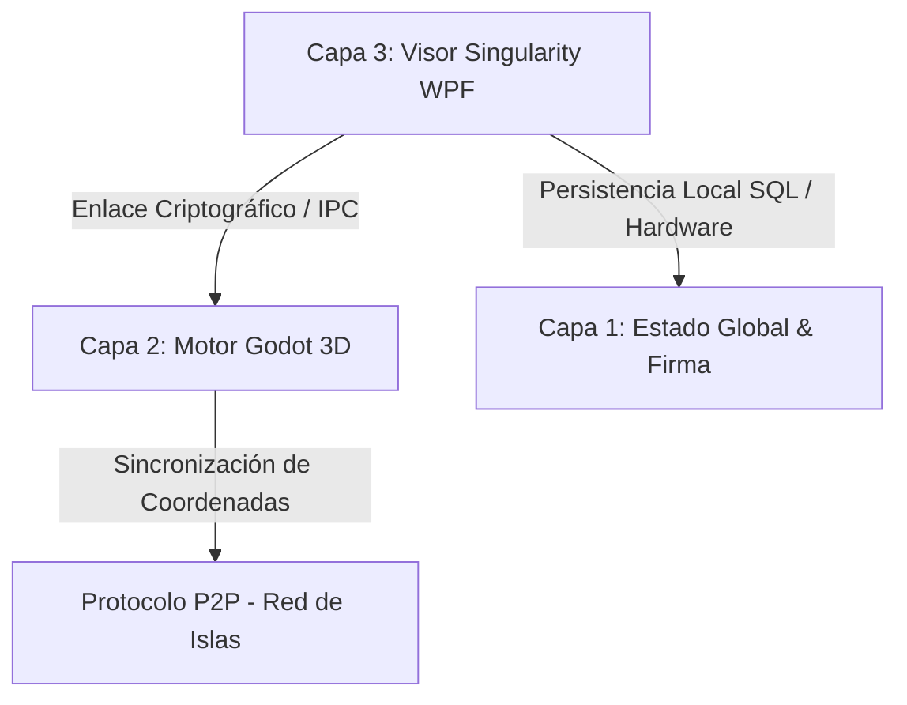

# ⬢ WoldVirtual P2P 3D — Metaverso Cripto Descentralizado

> **🎯 Estado del Proyecto:** Prototipo Funcional de Alta Fidelidad y Visor Estético Completado.
> Integración fluida del motor 3D de Godot incrustado en un visor WPF moderno y descentralizado de 3 Capas.

---

## 🔍 Arquitectura de 3 Capas Implementada

La arquitectura actual del proyecto conecta de forma segura el motor de renderizado 3D, la lógica de red local P2P y la persistencia criptográfica en el sistema de la siguiente manera:



1. **Capa 1: Persistencia y Firma (Estado Global):**
   * **Base de Datos SQLite:** Almacenamiento local seguro de identidades vinculadas a firmas de hardware.
   * **Criptografía de Hardware (Fingerprint):** Algoritmo de hash SHA-256 generado a partir de IDs únicos de CPU, Placa Base y Sistema Operativo obtenidos mediante WMI.
   * **Firma Digital Cuántica:** Exportación e importación segura de claves en un paquete `.zip` comprimido que resguarda la llave cuántica local.

2. **Capa 2: Motor Gráfico (Godot Engine):**
   * **Godot 4.6.2 Stable (Mono / C# / OpenGL3):** Renderizado en caliente embebido directamente mediante controladores nativos.
   * **Lógica del Mundo P2P:** Teletransporte P2P, gestión de físicas del avatar, renderizado de islas y shaders integrados.

3. **Capa 3: Visor Singularity (WPF / .NET 8):**
   * **Flujo del Wizard en 4 Pasos:** Registro guiado, generación automática de firma, validación de MetaMask y asignación de coordenadas de islas.
   * **Puente HTTP Local (Puerto 8080):** Pasarela de comunicación segura que intercepta la firma de MetaMask desde el navegador para transferirla directamente al Visor WPF.

---

## 🚀 Logros y Hitos Completados (Sesión de Rediseño)

### 💎 Rediseño Estético desde Cero del Visor WPF (`MainWindow.xaml`)
Se ha implementado una interfaz visual de altísima calidad inspirada en las mejores prácticas de la estética cyberpunk e interfaces tácticas de ciencia ficción:
* **Glow & Glassmorphism:** Paneles de cristal esmerilado con fondo translúcido (`#F2080E1C`), bordes cian muy sutiles y efectos de resplandor mediante sombras difusas y desenfocadas de neón.
* **Control Chrome Personalizado:** Ventana fija a `1600x950` sin barra nativa de Windows (`WindowStyle="None"`, `NoResize`) para evitar deformaciones físicas en el avatar, incorporando controles minimalistas de Minimizar y Cerrar con respuestas visuales interactivas.
* **Visuales y Inputs Premium:** Campos de entrada iluminados con transiciones de color en hover/foco y botones de acción dinámicos en neón cian, verde esmeralda y magenta.
* **HTTP Bridge Wait Overlay:** Alerta premium de validación de MetaMask con una barra animada que pulsa de forma infinita mientras escucha el puerto local.

### 🎮 Integración Total de Godot e Inmersión del Viewport 3D
* **Solución de Vibración del Avatar:** Fijación del visor nativo a coordenadas exactas y estiramiento por GPU, eliminando la vibración del avatar causada por constantes cambios de escala y recálculos en el `HwndHost`.
* **Modo Inmersivo 100%:** Al arrancar el metaverso, el `PanViewportContainer` se expande ocupando el **100% de la ventana** (`Grid.RowSpan="3"`, `Panel.ZIndex="99"`, `Stretch`).
* **Visualización Perfecta de Godot UI:** El panel interno de control de Godot ("RED P2P") y sus menús superiores ya no se solapan ni se ven obstruidos por barras laterales de WPF, disfrutando de toda la resolución de pantalla.
* **Desacoplamiento de Cierre Seguro (Cerrar Sesión):** Implementación de una bandera de exclusión (`_ignoreGodotExit`) que previene que WPF aborte el proceso global del visor al apagar Godot durante el teletransporte o el retorno al menú de inicio de sesión.
* **Dummy Controller de Retrocompatibilidad:** Todos los componentes requeridos por el código-detrás (`MainWindow.xaml.cs`) para su lógica interna (como la barra lateral antigua `PanSidebar`, anchos `ColSidebar` y etiquetas de islas) se mantuvieron encapsulados en un Grid oculto (`Visibility="Collapsed"`). Esto garantiza **cero errores de compilación y cero NullReferenceException** en tiempo de ejecución.

---

## 📅 Próximos Pasos en el Prototipo

1. **Pruebas de Concurrencia Multijugador:**
   * Iniciar dos instancias del Visor Singularity simulando diferentes firmas digitales y comprobar la sincronización del estado espacial 3D y la presencia del avatar.
2. **Refinamiento del Cierre de Sesión (Cerrar Sesión):**
   * Refinar el retorno y limpieza total de la memoria e hilos de ejecución de sockets tras múltiples cierres e inicios de sesión consecutivos en el visor P2P.
3. **Refinamiento de Assets P2P:**
   * Continuar optimizando el renderizado gráfico de las islas y la sincronización de archivos JSON en tiempo real sin dependencias externas o servidores centralizados.

## ☀️ Verano de IAs: Roadmap Estratégico de Desarrollo (Core P2P)

**Período:** 25 de junio al 31 de agosto (67 días de desarrollo intensivo).
**Capacidad:** 4 horas/día = 268 horas totales.
**Metodología de Desarrollo AI-Assisted:** Asignación de 67 horas dedicadas a cada entorno/agente (Antigravity, Cursor, Trae, VS Code), maximizando el paralelismo cognitivo para construir la infraestructura de red descentralizada del metaverso.

---

### 📅 Fase 1: Criptografía de Hardware, Identidad y Sockets Base (Días 1 a 20)

*   **Objetivo Maestro:** Establecimiento de la capa de transporte segura y generación de identidades únicas irrefutables vinculadas al hardware físico, fundamentales para la soberanía del usuario en un metaverso DeFi.
*   **Hito Técnico:** Dos nodos pueden descubrirse mutuamente en la red local e intercambiar un *handshake* criptográfico sin depender de servidores DNS o intermediarios centrales, garantizando una verdadera descentralización.

*   **Distribución del Flujo de Trabajo (4 Horas/Día):**
    *   ⏱️ **Hora 1 (Antigravity - Arquitectura & Diseño):** Análisis algorítmico y viabilidad de los modelos de Hash. Diseño del esquema de seguridad (SHA-256 + Salts aleatorios) para extraer IDs de hardware (CPU, Placa Base, OS) garantizando colisiones nulas y mitigando vectores de ataque de suplantación de identidad en el juego. **Mejores Prácticas DeFi:** Implementar una arquitectura de "confianza cero" (zero-trust) y soluciones de identidad descentralizada (DID) para devolver el control de los datos personales al usuario, previniendo la suplantación de avatares y el acceso no autorizado. Considerar la resistencia a la computación cuántica para la criptografía a largo plazo. <cite data-cite="1"></cite><cite data-cite="5"></cite>
    *   ⏱️ **Hora 2 (Cursor - Desarrollo Core C#):** Implementación exhaustiva de la lógica de identidad (`HardwareFingerprint.cs`). Programación de las consultas WMI (Windows Management Instrumentation) seguras y la serialización para encapsular la firma digital en paquetes comprimidos y encriptados de exportación (`.zip`). **Mejores Prácticas DeFi:** Asegurar el almacenamiento de claves privadas mediante hardware wallets, almacenamiento offline o técnicas de fragmentación de claves (Shamir's Secret Sharing). Implementar mecanismos de rotación de claves y procesos seguros para la generación y firma de transacciones en un entorno aislado. <cite data-cite="2"></cite><cite data-cite="3"></cite>
    *   ⏱️ **Hora 3 (Trae - Implementación de Red):** Programación del servidor TCP/IP asíncrono y los *listeners* de red (`TcpListener`). Creación de los pools de hilos de alto rendimiento y las rutinas de *heartbeat* (latidos) para mantener vivos los sockets P2P y manejar las desconexiones súbitas de los jugadores. **Mejores Prácticas DeFi:** Implementar protocolos de comunicación P2P robustos y cifrados de extremo a extremo. Asegurar la autenticación mutua entre nodos para prevenir ataques de intermediario (man-in-the-middle) y garantizar la integridad de la red.
    *   ⏱️ **Hora 4 (VS Code - QA, Refactor y Testing):** Consolidación estructural del código. Ejecución de pruebas de humo (*smoke testing*) levantando múltiples instancias simultáneas en bucle local (loopback `127.0.0.1`), comprobando la persistencia en SQLite y validando que no se generen fugas de sockets no cerrados. **Mejores Prácticas DeFi:** Realizar auditorías de seguridad de código regulares, pruebas de penetración y fuzzing para identificar vulnerabilidades. Implementar monitoreo continuo de la red para detectar actividades anómalas y posibles ataques.

*   **Entregable:** Librería Core de enlace de red que permite conectar dos Visores Singularity directamente de igual a igual (P2P) y validar la sesión mediante firmas, sentando las bases para una economía digital segura.

---

### 📅 Fase 2: Motor de Tráfico, Throttling y Distribución Descentralizada (Días 21 a 40)

*   **Objetivo Maestro:** Implementación del sistema de distribución de archivos (*file-sharing* P2P) con control estricto de recursos físicos del jugador, crucial para la sostenibilidad y equidad en un metaverso DeFi.
*   **Hito Técnico:** Capacidad de compartir el cliente/visor (.zip del juego base) y los *assets* 3D de las islas sin superar jamás el límite estricto *hard-coded* de **300 MB** de subida por nodo, optimizando el uso de recursos de red.

*   **Distribución del Flujo de Trabajo (4 Horas/Día):**
    *   ⏱️ **Hora 1 (Antigravity - Arquitectura & Diseño):** Diseño del algoritmo *Token Bucket* o *Leaky Bucket* para la modelación del ancho de banda (Throttling). Análisis de la fragmentación óptima de paquetes y prevención de interbloqueos ante congestiones de red en enrutadores domésticos. **Mejores Prácticas DeFi:** Diseñar mecanismos de throttling que sean resistentes a ataques de denegación de servicio (DoS/DDoS) y que garanticen un acceso justo a los recursos de la red para todos los participantes.
    *   ⏱️ **Hora 2 (Cursor - Desarrollo Core C#):** Codificación del motor de transferencia por *chunks* (fragmentos asíncronos en RAM). Implementación de los limitadores de subida mediante `Task.Delay` dinámicos, que calibran milisegundo a milisegundo los *bytes-per-second* en el torrente de transmisión. **Mejores Prácticas DeFi:** Asegurar la integridad de los datos transferidos mediante sumas de verificación criptográficas y firmas digitales. Implementar mecanismos de retransmisión robustos para garantizar la entrega de datos en redes inestables.
    *   ⏱️ **Hora 3 (Trae - Implementación de Red):** Gestión multiplexada de conexiones masivas concurrentes. Asegurar que si 10 usuarios solicitan archivos simultáneamente de un solo jugador, el límite total de salida se reparta matemáticamente de forma justa (ej. max. 30 MB por conexión simultánea), evitando estrangular la línea del anfitrión. **Mejores Prácticas DeFi:** Implementar algoritmos de equidad en la distribución de ancho de banda para prevenir que un solo nodo monopolice los recursos. Considerar el uso de redes de entrega de contenido (CDN) descentralizadas para activos populares.
    *   ⏱️ **Hora 4 (VS Code - QA, Refactor y Testing):** Profiling de estrés en entornos simulados de red con altas latencias. Monitoreo automatizado para certificar frente al *Administrador de Tareas* de Windows que el consumo de ancho de banda jamás supera el umbral máximo exigido. **Mejores Prácticas DeFi:** Realizar pruebas de carga y estrés exhaustivas para asegurar la estabilidad de la red bajo condiciones extremas. Monitorear métricas de rendimiento y seguridad en tiempo real para identificar cuellos de botella o vulnerabilidades.

*   **Entregable:** Motor de transferencia modular capaz de actuar como un ecosistema "BitTorrent" encriptado privado, asegurando que el instalador de WoldVirtual se auto-distribuya de manera viral y sostenible entre la comunidad, fomentando la resiliencia y la descentralización.

---

### 📅 Fase 3: Estado Global, Sincronización JSON y "Cero Absoluto" (Días 41 a 60)

*   **Objetivo Maestro:** Sincronización descentralizada del estado universal del metaverso (las miles de islas generadas) garantizando la consistencia eventual y descentralizada de los datos, esencial para la interoperabilidad y la confianza en un entorno DeFi.
*   **Hito Técnico:** Todo nodo es capaz de asimilar, fusionar y persistir su archivo `estado_metaverso.json` maestro de forma atómica y sin pisarse con los avances de otros jugadores en la red, manteniendo la integridad del estado global.

*   **Distribución del Flujo de Trabajo (4 Horas/Día):**
    *   ⏱️ **Hora 1 (Antigravity - Arquitectura & Diseño):** Modelado estructural de base de datos JSON en esquemas CRDT (*Conflict-free Replicated Data Types*). Estrategia heurística basada en marcas de tiempo (Relojes de Lamport) para dictaminar automáticamente el estado final si dos jugadores plantan una isla en la misma hora exacta. **Mejores Prácticas DeFi:** Utilizar CRDTs para garantizar la consistencia eventual y la resolución automática de conflictos en un entorno distribuido. Implementar mecanismos de consenso ligeros para la validación de estados críticos.
    *   ⏱️ **Hora 2 (Cursor - Desarrollo Core C#):** Implementación de la directiva algorítmica del "Cero Absoluto" `(0, 0, 0)`. Lógica genética: cuando un nodo arranca y no detecta pares en la red (o pierde el contacto total con la DHT), inicia su tabla vacía y genera la coordenada base Génesis de inmediato. **Mejores Prácticas DeFi:** Asegurar que el estado inicial (génesis) sea inmutable y verificable criptográficamente. Implementar mecanismos de recuperación de estado robustos para nodos que se unen o reconectan a la red.
    *   ⏱️ **Hora 3 (Trae - Implementación de Red):** Sincronización diferencial extrema (*Delta Syncing*). En lugar de enviar un archivo gigantesco con todo el universo cada segundo, se programan rutinas de comparación que extraen únicamente los registros de islas modificados o creados en los últimos minutos (Deltas), reduciendo el consumo de red a ínfimos *Kilobytes*. **Mejores Prácticas DeFi:** Implementar firmas digitales en los deltas de estado para asegurar su autenticidad e integridad. Utilizar técnicas de compresión y optimización de red para minimizar el ancho de banda.
    *   ⏱️ **Hora 4 (VS Code - QA, Refactor y Testing):** Simulaciones intensivas de "Cerebro Dividido" (*Split-brain network partitioning*). Aislar dos grupos de nodos intencionadamente, poblar de islas sus redes y reconectarlos posteriormente para comprobar la curación automática del estado mediante la fusión inteligente y fluida del JSON. **Mejores Prácticas DeFi:** Realizar pruebas de resiliencia de la red ante particiones y fallos. Implementar mecanismos de monitoreo de la consistencia del estado global y alertas para desviaciones.

*   **Entregable:** Matriz de almacenamiento inmutable y distribuida. Un cosmos virtual cuyo "recuerdo" de todas las construcciones perdurará mientras haya un nodo encendido, garantizando la persistencia y la historia del metaverso.

---

### 📅 Fase 4: Integración 3D en Godot, Desacoplamiento y Cierre Open Source (Días 61 a 67)

*   **Objetivo Maestro:** Enlazar el poderoso y asíncrono puente C# P2P con el contexto gráfico, el sistema de físicas y el renderizado interno de Godot 4.6.2, asegurando una experiencia de usuario fluida y segura en el metaverso DeFi.
*   **Hito Técnico:** Representar visualmente las transacciones P2P en pantalla 3D; donde cada avatar e isla reaccione instantáneamente al paso de paquetes TCP/UDP sin causar *Stuttering* o caída de FPS, manteniendo la inmersión.

*   **Distribución del Flujo de Trabajo (4 Horas/Día):**
    *   ⏱️ **Hora 1 (Antigravity - Arquitectura & Diseño):** Profiling final de paralelismo multihilo. Revisión pormenorizada para extirpar *Deadlocks* (cuellos de botella por esperas de hilos compartidos) en la comunicación IPC (Inter-Process) entre el entorno WPF de .NET 8 y la instancia nativa del motor de Godot. **Mejores Prácticas DeFi:** Implementar mecanismos de comunicación entre procesos (IPC) seguros y auditables. Asegurar que la interacción entre el motor 3D y la lógica de la blockchain sea atómica y resistente a fallos.
    *   ⏱️ **Hora 2 (Cursor - Desarrollo Core C#):** Transpositor universal de coordenadas espaciales. Algoritmo crítico para concatenar la posición general macro: `(Posición Matemática Real = Eje de la Isla Macro + Posición de Avatar Micro)`. Resolución y refactorización orientada a dobles (`double precision`) previniendo colapsos de cálculo flotante al explorar los límites más lejanos del Metaverso 3D. **Mejores Prácticas DeFi:** Utilizar tipos de datos de alta precisión para coordenadas y cálculos económicos para evitar errores de redondeo que podrían ser explotados. Implementar validación de límites y rangos para todas las operaciones espaciales.
    *   ⏱️ **Hora 3 (Trae - Implementación de Red):** Enrutamiento predictivo y "Co-Seeding" preventivo de assets (Modelos, texturas). El nodo inteligente precarga fragmentos de mapa en segundo plano extrapolando el trayecto del avatar, dotando a la experiencia inmersiva de cero pantallas de carga. **Mejores Prácticas DeFi:** Implementar mecanismos de verificación criptográfica para todos los activos precargados para prevenir la inyección de activos maliciosos. Asegurar que el enrutamiento predictivo no revele información sensible del usuario.
    *   ⏱️ **Hora 4 (VS Code - QA, Refactor y Testing):** Pulido terminal del árbol de ramas en Github, incorporación integral de XML Docs en interfaces C# y formateo general con linting. Cierre absoluto de incidencias residuales para garantizar que el compilador refleje **cero errores y cero advertencias** en la solución Release final. **Mejores Prácticas DeFi:** Mantener un control de versiones riguroso y realizar revisiones de código por pares. Publicar documentación técnica clara y completa, incluyendo especificaciones de seguridad y auditorías. Fomentar la participación de la comunidad en la identificación de vulnerabilidades.

*   **Entregable:** El lanzamiento definitivo (*v1.0.0 Alpha*) del core distribuido WoldVirtual; un ecosistema documentado, seguro y abierto, capacitado para que cualquier usuario instale la semilla tecnológica y propague el juego libremente, promoviendo la adopción y la innovación en el metaverso DeFi.

---

## 🕸️ Hoja de Ruta: IPFS Real en C# (`p2pipfsCS`)

> **📁 Carpeta:** [`Capa3_Visor/CapaVisor3D/p2pipfsCS/`](file:///d:/WCVcoinMTB/Capa3_Visor/CapaVisor3D/p2pipfsCS)
> **🗂️ Archivo principal:** [`P2PWebNode.cs`](file:///d:/WCVcoinMTB/Capa3_Visor/CapaVisor3D/p2pipfsCS/P2PWebNode.cs)

### 🎯 Objetivo

Evolucionar el nodo P2P simulado (HTTP local con ZIP) hacia un **nodo IPFS nativo en C#**, capaz de publicar contenido en la red descentralizada real de IPFS sin depender de Go-IPFS ni de binarios externos. El widget `P2PNodeBar` ya está integrado en la barra de menú del visor WPF y será la ventana de estado de este sistema.

---

### 📊 Estado Actual de `P2PWebNode.cs`

| Componente | Estado | Descripción |
|---|---|---|
| `HttpListener` local (puerto 8082) | ✅ **COMPLETO** | Servidor HTTP embebido en C# funcionando |
| Generación de `NodeId` (`NDxxxxx`) | ✅ **COMPLETO** | ID único por sesión basado en hash del usuario |
| `SimulatedUrl` (`www.NDxxxxx.ipfs`) | ✅ **COMPLETO** | URL IPFS simulada para identificación visual |
| ZIP del repositorio bajo demanda | ✅ **COMPLETO** | Compresión async excluyendo `.git`, `obj`, `peers` |
| Landing page de invitación (HTML/CSS) | ✅ **COMPLETO** | Página Cyberpunk de descarga servida en `/` |
| `P2PNodeBar` en barra de menú WPF | ✅ **COMPLETO** | Widget incrustado — reemplaza Popup flotante |
| `OnStatusChanged` event | ✅ **COMPLETO** | Eventos de estado conectados a `TxtP2PStatus` |
| **IPFS real (Content Addressing)** | 🔴 **PENDIENTE** | No hay hashing CIDv1 ni protocolo libp2p real |
| **DHT Kademlia / descubrimiento de pares** | 🔴 **PENDIENTE** | Sin descubrimiento de nodos en red pública |
| **Transferencia bitswap** | 🔴 **PENDIENTE** | Sin protocolo de intercambio de bloques IPFS |
| **Publicación en red pública IPFS** | 🔴 **PENDIENTE** | Sin conexión a bootstrap nodes de IPFS |
| **TLS / cifrado de transporte** | 🔴 **PENDIENTE** | HTTP plano sin TLS ni Noise Protocol |

---

### 🗺️ Hoja de Ruta por Pasos — Integración IPFS Real en C#

#### Paso 1 — CID Real (Content Identifier v1) `[ ]`
> **Estado:** 🔴 No iniciado

Implementar el **hash criptográfico SHA2-256 + codificación multihash** para calcular el `CIDv1` real de cada bloque de contenido. Este es el núcleo de IPFS: el contenido se identifica por su hash, no por su URL.

```csharp
// En P2PWebNode.cs — nuevo método a añadir
private string ComputeCidV1(byte[] data)
{
    // 1. SHA-256 del bloque
    using var sha = System.Security.Cryptography.SHA256.Create();
    byte[] hash = sha.ComputeHash(data);

    // 2. Multihash prefix: 0x12 (sha2-256) + 0x20 (32 bytes)
    byte[] multihash = new byte[] { 0x12, 0x20 }.Concat(hash).ToArray();

    // 3. CIDv1: version=1 + codec=dag-pb(0x70) + multihash → Base32
    byte[] cidBytes = new byte[] { 0x01, 0x70 }.Concat(multihash).ToArray();
    return "b" + Base32.ToBase32(cidBytes).ToLower(); // CIDv1 base32lower
}
```

**Paquete NuGet requerido:** `SimpleBase` (Base32/Base58 encoding)

---

#### Paso 2 — Estructura de Bloques DAG-PB `[ ]`
> **Estado:** 🔴 No iniciado

IPFS estructura los archivos en **bloques de 256 KB** enlazados como un DAG (Grafo Acíclico Dirigido). El archivo ZIP del visor se divide en bloques, cada uno con su CIDv1, y se crea un nodo raíz que los enlaza.

```csharp
// Clase a crear: IpfsBlock.cs en p2pipfsCS/
public class IpfsBlock
{
    public byte[] Data { get; set; }
    public string Cid { get; set; }        // CIDv1 calculado
    public List<string> Links { get; set; } // CIDs de sub-bloques
    public long Size { get; set; }
}
```

**Archivo nuevo:** `p2pipfsCS/IpfsBlock.cs`

---

#### Paso 3 — Almacén Local de Bloques (Blockstore) `[ ]`
> **Estado:** 🔴 No iniciado

Directorio local donde se persisten los bloques IPFS. Cada bloque se guarda como `<CID>.block` en disco. Esto permite que el nodo sirva su contenido a otros pares aunque se reinicie.

```
Estado_Global/
└── ipfs_blockstore/
    ├── bafybei...abc.block   ← bloque de datos
    ├── bafybei...def.block
    └── bafybei...ghi.block   ← nodo raíz (enlaza todos)
```

**Integración:** El `BASE_DIR` de `NetworkLayer.gd` ya apunta a `Estado_Global/` — el blockstore se añade como subdirectorio.

---

#### Paso 4 — Protocolo libp2p: Transport TCP + Noise `[ ]`
> **Estado:** 🔴 No iniciado

Sustituir el `HttpListener` plano por un **socket TCP libp2p con Noise Protocol** para cifrado de transporte. libp2p es la capa de red de IPFS.

**Paquete NuGet:** `Nethermind.Libp2p` (implementación C# de libp2p)

```csharp
// Esquema de reemplazo en P2PWebNode.cs
// ANTES: HttpListener _listener
// DESPUÉS:
private IHost _libp2pHost;

private async Task StartLibp2pNode()
{
    var builder = new ServiceCollection()
        .AddLibp2p(b => b.WithTcp().WithNoise().WithMplex())
        .BuildServiceProvider();

    _libp2pHost = builder.GetRequiredService<IHost>();
    await _libp2pHost.StartAsync();
    LocalPeerId = _libp2pHost.GetPeerId().ToString();
}
```

---

#### Paso 5 — DHT Kademlia: Descubrimiento de Pares `[ ]`
> **Estado:** 🔴 No iniciado

Conectar a los **bootstrap nodes públicos de IPFS** para unirse a la DHT Kademlia y ser descubrible por otros nodos. Los bootstrap nodes oficiales son:

```
/dnsaddr/bootstrap.libp2p.io/p2p/QmNnooDu7bfjPFoTZYxMNLWUQJyrVwtbZg5gBMjTezGAJN
/dnsaddr/bootstrap.libp2p.io/p2p/QmQCU2EcMqAqQPR2i9bChDtGNJchTbq5TbXJJ16u19uLTa
```

```csharp
// Método a añadir: ConnectToBootstrapNodes()
private static readonly string[] BootstrapNodes = {
    "/dnsaddr/bootstrap.libp2p.io/p2p/QmNnooDu7bfjPFoTZYxMNLWUQJyrVwtbZg5gBMjTezGAJN",
    "/ip4/104.131.131.82/tcp/4001/p2p/QmaCpDMGvV2BGHeYERUEnRQAwe3N8SzbUtfsmvsqQLuvuJ"
};
```

---

#### Paso 6 — Protocolo Bitswap: Intercambio de Bloques `[ ]`
> **Estado:** 🔴 No iniciado

**Bitswap** es el protocolo de intercambio de bloques de IPFS. Los nodos anuncian qué bloques tienen (`HAVE`) y solicitan los que les faltan (`WANT`). Reemplaza la descarga directa del ZIP.

```csharp
// Nuevo archivo: p2pipfsCS/BitswapSession.cs
public class BitswapSession
{
    public async Task<byte[]> GetBlock(string cid, CancellationToken token)
    {
        // 1. Buscar el bloque en el blockstore local
        // 2. Si no está, anunciar WANT a pares conectados via DHT
        // 3. Recibir el bloque, verificar CID, almacenar
        // 4. Propagar a otros pares interesados (seeding)
    }
}
```

---

#### Paso 7 — IPNS: Nombre Estable para el Nodo `[ ]`
> **Estado:** 🔴 No iniciado

**IPNS (InterPlanetary Name System)** permite publicar un nombre estable (`/ipns/<PeerID>`) que apunta al CID raíz del visor. Así, aunque el ZIP se actualice y su CID cambie, la URL del nodo permanece constante.

```csharp
// El SimulatedUrl actual: "www.NDxxxxx.ipfs" (solo visual)
// Con IPNS real: "/ipns/12D3KooW..." → apunta siempre al último ZIP
public string IpnsAddress => $"/ipns/{LocalPeerId}";
```

---

#### Paso 8 — Integración Final con `P2PNodeBar` y Godot `[ ]`
> **Estado:** 🔴 No iniciado

- `TxtP2PNodeId` mostrará el **PeerID libp2p real** en formato `12D3KooW...`
- `TxtP2PLink` mostrará la **dirección multiaddr** del nodo (`/ip4/x.x.x.x/tcp/4001`)
- `TxtP2PStatus` reflejará el estado DHT: `Conectado a X pares | Y bloques servidos`
- El `NetworkLayer.gd` de Godot recibirá el PeerID real vía IPC para mostrarlo en el panel lateral RED P2P

---

### 📦 Dependencias NuGet a Añadir

```xml
<!-- En VisorSingularity.csproj -->
<PackageReference Include="Nethermind.Libp2p"     Version="1.*" />
<PackageReference Include="SimpleBase"             Version="4.*" />
<PackageReference Include="Google.Protobuf"        Version="3.*" />
```

---

### ⏱️ Estimación de Esfuerzo

| Paso | Descripción | Horas estimadas | Prioridad |
|------|-------------|-----------------|-----------|
| 1 | CIDv1 en C# | 4 h | 🔥 Alta |
| 2 | DAG-PB bloques | 6 h | 🔥 Alta |
| 3 | Blockstore local | 3 h | 🔥 Alta |
| 4 | libp2p TCP+Noise | 12 h | 🟠 Media |
| 5 | DHT Kademlia | 10 h | 🟠 Media |
| 6 | Bitswap | 14 h | 🟠 Media |
| 7 | IPNS | 8 h | 🟡 Baja |
| 8 | Integración WPF+Godot | 4 h | 🔥 Alta |
| **Total** | | **~61 h** | |

---

## 📋 **SESIÓN ACTUAL - RAMA: DevTraeIA**

### 🚀 **LO DESARROLLADO HOY (20 de mayo de 2026)**

#### **1. Sistema de Cierre de Sesión Mejorado**
- **Implementación completa** del evento `BtnCerrarSesion_Click` en [MainWindow.xaml.cs](file:///d:/WCVcoinMTB/WoldVirtual/WoldVirtual3Dp2p/Capa3_Visor/MainWindow.xaml.cs)
- **Instrumentación de depuración** con 10 puntos de instrumentación para rastrear la ejecución
- **Manejo robusto de errores** con try-catch-finally completo
- **Timeout controlado** para limpieza de recursos de Godot
- **Terminación forzada** de procesos residuales de Godot

#### **2. Modificación con Dispatcher.BeginInvoke**
- **Solución implementada** en la función `HideDashboardShowWizard()`
- **Retraso de la ocultación** del panel `PanLeftSidebar` hasta que el evento click se complete
- **Prioridad Background** para asegurar que la interfaz no se bloquee

#### **3. Sistema de Logging Avanzado**
- **Archivo de logs específico**: `debug_logout_trace.log`
- **Envío de logs** a servidor de depuración local (puerto 3001)
- **Registro local** para diagnóstico inmediato
- **Múltiples puntos de instrumentación** en todo el flujo de cierre de sesión

#### **4. Análisis Científico del Problema**
- **Creación de documentación** en [debug-visor-logout-failure.md](file:///d:/WCVcoinMTB/debug-visor-logout-failure.md)
- **Hipótesis H6 identificada**: "El botón 'CERRAR SESIÓN' está en un panel que se oculta inmediatamente al hacer clic, interrumpiendo la ejecución del evento"
- **Evidencia recopilada** de logs de tiempo de ejecución

#### **5. Guía de Instrucciones**
- **Creación de** [INSTRUCCIONES_CIERRE_SESION.md](file:///d:/WCVcoinMTB/INSTRUCCIONES_CIERRE_SESION.md)
- **Pasos detallados** para probar el cierre de sesión
- **Recopilación de evidencia** para diagnóstico


### 📝 **LO PENDIENTE PARA RESOLVER**

## Rama DevOpencode

### Pendientes
- ❌ Intento fallido de conectar el visor mediante túneles SSH (localhost.run) con webnodes diferentes para cada sesión de cada usuario. La implementación actual (P2PWebNode + IPFSTunnelConnector) usa `ssh -R` a localhost.run y captura la URL pública, pero no se completó la integración funcional. Pendiente de revisión y corrección.