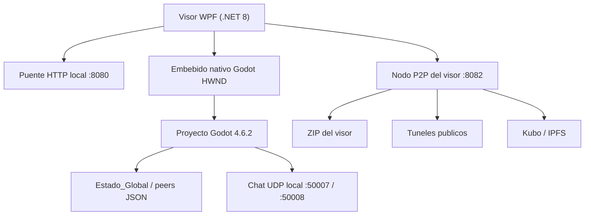

# WoldVirtual P2P 3D

Metaverso 3D experimental para Windows que combina un visor WPF en .NET 8, un proyecto Godot 4.6.2 embebido y un sistema de sincronizacion P2P basado en archivos JSON, UDP local y distribucion del visor por ZIP, tuneles publicos e IPFS.

> Estado actual del repositorio: prototipo funcional local, sin CI ni tests automatizados, con build WPF verificada el 23 de mayo de 2026.

---

### Actualizacion de hoy

**Fecha:** `2026-06-07`  
**Rama de trabajo:** `DevAntigravityIA`

### Hecho en `DevAntigravityIA`

- **Inicio de Sesión en 3 Fases con Logotipo Central:**
  - Diseñada la pantalla de inicio de sesión (`GridLoginScreen`) con un logotipo de bienvenida central y tres fases progresivas:
    - **Fase 1:** Validación de usuario y contraseña local contra `credentials.json` con soporte para recordar credenciales.
    - **Fase 2:** Firma digital criptográfica de hardware mediante generación de hash SHA-256. Se integra un diálogo interactivo del explorador (`SaveFileDialog`) para guardar o sustituir el archivo ZIP del registro de firma de hardware de manera explícita y segura.
    - **Fase 3:** Vinculación de billetera mediante firma en la interfaz web de MetaMask en puerto `8080`.
- **Detección Automática de Cuenta Inexistente / Reset de Registro:**
  - Actualizado `CheckExistingRegistrationAsync` en [MainWindow.xaml.cs](file:///Capa3_Visor/CapaVisor3D/MainWindow.xaml.cs) para validar simultáneamente la existencia de la firma del PC (`firma_hardware.zip`), las credenciales locales (`credentials.json`) y el perfil del metaverso (`current_user.json`).
  - Si falta alguno de estos componentes, el visor fuerza automáticamente el desvío hacia la pantalla inicial de escaneo de hardware y registro de PC.
- **Transición e Integración de UI al Metaverso en Login Directo:**
  - Modificado `LaunchAndEmbedGodot` para que, al iniciar sesión directamente (cargando la escena `N3DWoldVirtualMT.tscn` en Godot sin pasar por el registro), se activen inmediatamente en el visor la barra del nodo P2P (`P2PNodeBar`), la barra del servidor virtual (`EmbeddedServerNodeBar`), y la barra inferior de chat, logrando una transición fluida equivalente al flujo de registro de avatar.
  - Implementada la función `GetSavedUserInfo()` para resolver de forma dinámica la información del usuario (nombre, wallet e isla por defecto) desde `current_user.json` durante el login con MetaMask.
- **Chat de Voz por Proximidad (NAudio + VAD + UDP + JSON):**
  - Captura de audio del micrófono en WPF usando la biblioteca [NAudio](file:///Capa3_Visor/CapaVisor3D/MainWindow.xaml.cs#L1160-L1190) y cálculo RMS en tiempo real para detección de actividad de voz (VAD).
  - Transmisión en tiempo real de eventos de habla a través de UDP en puerto `50007` a Godot.
  - Sincronización del estado de voz en disco modificando el campo `"vc"` del peer JSON (`peer_*.json`) en tiempo real.
  - Botón interactivo `BtnVoiceChat` (`🎤 VOZ`) con estados visuales cyberpunk diferenciados (Inactivo, Escuchando, Hablando).
  - En Godot (`ChatUI.gd` y `userbase3d.gd`), se implementó la visualización de un indicador de voz flotante (`((·))`) animado con pulsos de escala y fade-out sobre la cabeza de los avatares correspondientes.
  - Sincronización del indicador de voz para avatares remotos en `WorldManager.gd` a partir del estado `"vc"` del JSON.
- **Compartición de Webcam (OpenCvSharp PIP):**
  - Captura y conversión de video local utilizando [OpenCvSharp](file:///Capa3_Visor/CapaVisor3D/MainWindow.xaml.cs#L1365-L1440).
  - Solución al problema de superposición nativa (WPF Airspace Issue) mediante un `Popup` posicionado dinámicamente (`WebcamPopup`) sobre el control embebido de Godot.
  - Botón de chat `BtnWebcam` (`📷 CAM`) con feedback visual (verde/apagado) para alternar encendido.
- **HUD del Servidor Descentralizado (WPF):**
  - Corrección de visibilidad del HUD: el control [EmbeddedServerNodeBar](file:///Capa3_Visor/CapaVisor3D/MainWindow.xaml#L268-L282) ahora está oculto inicialmente (`Visibility="Collapsed"` en XAML) y su aparición tardía se activa limpiamente en `ActivateMetaverseUi()` tras hacer login.
- **Mejoras en UX de Registro de Avatar (Godot):**
  - Rediseño Glassmorphism del panel en `RegistroAV.gd` e incorporación de microanimaciones suaves por Tweens en botones (escala `1.05` en hover, y `0.95` al pulsar).
- **Mejoras en la Cámara (CameraController.gd):**
  - Altura (`tpv_height`) y distancia (`tpv_distance`) configurables para el perfil de tercera persona, con factor de interpolación base acelerado a `0.8` para mayor fluidez.
- **Sincronización P2P LAN (UDP Broadcast):** Implementado `PeerSyncService` que sincroniza archivos `peer_*.json` entre PCs en la misma red, integrado en `MainWindow.xaml.cs`.

### Pendiente en `DevAntigravity` (Fase 1 - Core de Seguridad y Protocolo)

| Estado | Tarea | Ruta principal | Nota |
|---|---|---|---|
| Pendiente | Diseñar Identidad Descentralizada (DID) | `docs/arquitectura/DID-model.md` | Documento de diseño: identidad = `SHA256(fingerprint HW + seed local)`. Formato DID, rotación de claves, recuperación. |
| Pendiente | Modelo de confianza entre pares | `docs/arquitectura/trust-model.md` | Esquema de reputación, handshake firmado, blacklist temporal, puntuación de nodo basada en uptime/contribución. |
| Pendiente | Protocolo de handshake P2P | `docs/arquitectura/handshake-protocol.md` | Especificación del intercambio inicial entre nodos: versión, capabilities, estado, firma. |
| Pendiente | Esquema de cifrado de peers | `docs/arquitectura/crypto-spec.md` | Cifrado asimétrico para handshake, simétrico (AES-GCM) para datos de estado. Gestión efímera de claves de sesión. |
| Pendiente | Revisar y endurecer `P2PWebNode.cs` | `Capa3_Visor/CapaVisor3D/p2pipfsCS/P2PWebNode.cs` | Añadir validación de firmas entrantes, límite de conexiones por IP, rate limiting. |

---­mite de conexiones por IP, rate limiting. |

---

## Resumen ejecutivo

Hoy el repositorio implementa estas piezas reales:

- Un wizard de entrada en WPF que genera una huella SHA-256 del hardware, permite guardar un ZIP de respaldo y conduce al usuario hacia la vinculacion de wallet.
- Un puente HTTP local en `http://localhost:8080/` que sirve `metamask.html`, recoge la firma del navegador y lanza el motor Godot embebido.
- Un embebido nativo de Godot dentro del visor WPF usando `HwndHost`.
- Un mundo 3D en Godot con avatar local/remoto, islas activas, HUD de wallet, chat local por UDP y panel lateral de teletransporte.
- Un nodo P2P del visor (`P2PWebNode`) que comprime el repo, lo sirve en local por HTTP, intenta exponerlo por tunel publico y puede apoyarse en Kubo/IPFS.
- Un sistema de estado global en `WoldVirtual/Estado_Global` con clases C# y sincronizacion por peers JSON desde Godot.

Tambien queda reflejado el ajuste mas reciente del repo:

- La barra `P2PNodeBar` del visor WPF vuelve a estar fija arriba a la derecha y ya no depende de superponerse sobre el area embebida de Godot.

---

## Arquitectura real del repo



### Capa 1: Visor WPF

Ruta principal:

- `Capa3_Visor/CapaVisor3D/MainWindow.xaml`
- `Capa3_Visor/CapaVisor3D/MainWindow.xaml.cs`
- `Capa3_Visor/CapaVisor3D/GodotHwndHost.cs`

Responsabilidades actuales:

- Escaneo de hardware por WMI.
- Generacion de fingerprint SHA-256.
- Exportacion de respaldo ZIP del registro local.
- Registro de usuario y transicion visual entre pantallas.
- Lanzamiento del navegador para MetaMask.
- Arranque del binario Godot incluido en el repo.
- Reenvio de teclado al avatar embebido.
- Chat de proximidad WPF por UDP.
- Barra superior `P2PNodeBar` con estado del nodo del visor.

### Capa 2: Proyecto Godot

Ruta principal:

- `WoldVirtual/project.godot`
- `WoldVirtual/EscenaPrincipal.tscn`
- `WoldVirtual/woldvirtual/scene/MTC/N3DWoldVirtualMT.tscn`

Responsabilidades actuales:

- Registro de avatar local en `RegistroAV.tscn`.
- Mundo 3D principal con chunk base, oceano, cielo, iluminacion y avatar.
- UI lateral de islas activas (`TeleportUI.gd`).
- HUD superior derecho de wallet y balance (`WalletUI.gd`).
- Chat local con burbujas 3D sobre avatars (`ChatUI.gd` + `userbase3d.gd`).
- ECS interno para interpolacion, salida de red y visibilidad.

### Capa 3: Estado global y sincronizacion

Rutas principales:

- `WoldVirtual/Estado_Global/`
- `WoldVirtual/woldvirtual/gdscrip/NetworkLayer.gd`
- `WoldVirtual/woldvirtual/gdscrip/IslandStateSync.gd`

Responsabilidades actuales:

- Persistencia de peers en `Estado_Global/peers`.
- Fusion de estados por archivo JSON.
- Gestion de sesion e islas en C#.
- Version antigua y version actual de sincronizacion coexistiendo en el repo.

---

## Flujo real de ejecucion

1. El visor WPF arranca en `GridPcRegistration`.
2. Se ejecuta un escaneo WMI del equipo y se calcula una firma SHA-256.
3. El usuario puede guardar un respaldo ZIP con `registro_hardware.txt` y `signature.key`.
4. Se habilita el paso de registro de usuario en WPF.
5. El visor levanta `HttpListener` en `localhost:8080` y abre el navegador con `www/metamask.html`.
6. El navegador solicita cuenta MetaMask y firma, con fallback simulado si MetaMask no existe.
7. El callback `/confirm` cierra el bridge, muestra `GridMainViewer` y lanza Godot con argumentos:

```text
--wallet
--user-id
--island-id
```

8. WPF localiza la ventana del proceso Godot, la incrusta en el `GodotPlaceholder` y redirige teclado.
9. Godot registra el usuario en `current_user.json`, carga `N3DWoldVirtualMT.tscn` y activa UI/estado.
10. WPF inicia el listener UDP del chat y el nodo P2P del visor.

---

## Estado funcional por modulo

### WPF / launcher

| Modulo | Estado | Notas |
|---|---|---|
| `MainWindow.xaml.cs` | Activo | Orquesta wizard, MetaMask, Godot, chat y barra P2P |
| `GodotHwndHost.cs` | Activo | Embebido Win32 del motor Godot dentro de WPF |
| `www/metamask.html` | Activo | Flujo visual de firma y fallback simulado |
| Build `dotnet build` | Verificada | Compilo bien el 23 de mayo de 2026 |

### Godot / mundo 3D

| Modulo | Estado | Notas |
|---|---|---|
| `RegistroAV.gd` | Activo | Guarda `username`, `gender`, `wallet` y cambia de escena |
| `ChunkManager.gd` | Activo | Inyecta `NetworkLayer`, `WorldManager`, `AvatarController` y ECS |
| `WorldManager.gd` | Activo | Spawnea islas y usuarios, limpia ghost islands, asigna slots |
| `userbase3d.gd` | Activo | Movimiento local, salto, carrera y burbujas 3D |
| `TeleportUI.gd` | Activo con auto-ocultacion | Se oculta cuando detecta wallet/embebido en WPF |
| `WalletUI.gd` | Activo | Muestra wallet truncada y balance `0.000 WCV` |
| `ChatUI.gd` | Activo y headless | Usa UDP, sin panel propio visible dentro de Godot |
| `EnvironmentManager.gd` | Activo | Tonemapping, SSAO, SSIL, SDFGI y ciclo solar |
| `PerformanceManager.gd` | Activo | Baja/sube calidad segun FPS y reporta VRAM |

### Estado global C#

| Modulo | Estado | Notas |
|---|---|---|
| `GlobalConfig.cs` | Activo | Resuelve rutas dinamicamente |
| `SessionManager.cs` | Activo | Inicia/cierra sesiones y visita de islas |
| `IslandStateManager.cs` | Activo | Vigila `peer_*.json`, fusiona y aplica cuota |
| `QuotaManager.cs` | Activo | Resume RAM/VRAM/almacenamiento del nodo |
| `SharedModels.cs` | Activo | Modelos JSON y source generation |

### P2P del visor / distribucion

| Modulo | Estado | Notas |
|---|---|---|
| `P2PWebNode.cs` | Activo | Sirve landing, ZIP, proxy local y estado a la UI |
| `IpfsManager.cs` | Activo con dependencia externa | Descarga/arranca Kubo si hace falta |
| `IpfsPublisher.cs` | Activo | Publica archivos o directorios por CLI de Kubo |
| `P2PNodeBar` | Activo | Widget WPF fijado arriba a la derecha |
| `ServidorVirtualCS` | Activo en integracion | HUD superior central para servidor descentralizado, recursos compartidos y control manual de aportacion |

---

## Estado P2P e IPFS hoy

Lo que ya existe de verdad en el codigo:

- HTTP local del nodo del visor en `127.0.0.1:8082`.
- ZIP del repo generado bajo demanda.
- Landing page de descarga servida por el propio nodo.
- Intento de tunel publico con Cloudflare Quick Tunnel y alternativas SSH.
- Integracion con Kubo descargable automaticamente.
- Publicacion por `ipfs add` via CLI.
- Actualizacion visual del estado del nodo en la UI WPF.

Lo que todavia no es un nodo P2P puro de metaverso:

- No hay libp2p nativo implementado dentro del juego.
- No hay descubrimiento de pares del metaverso sobre una DHT propia.
- La sincronizacion principal de avatars/islas sigue basada en archivos JSON locales.
- El reparto de mundo sigue siendo prototipo, no una red publica multijugador validada.

---

## Estructura del repositorio

```text
D:\WCVcoinMTB
├─ Capa3_Visor/
│  └─ CapaVisor3D/
│     ├─ MainWindow.xaml
│     ├─ MainWindow.xaml.cs
│     ├─ GodotHwndHost.cs
│     ├─ VisorSingularity.csproj
│     ├─ www/
│     └─ p2pipfsCS/
├─ WoldVirtual/
│  ├─ project.godot
│  ├─ EscenaPrincipal.tscn
│  ├─ servidorinterno/
│  ├─ Estado_Global/
│  └─ woldvirtual/
├─ IAs/
│  ├─ DevCursorIA/
│  └─ DevTraeIA/
└─ README.md
```

---

## Como compilar y ejecutar

### Requisitos reales

- Windows.
- .NET SDK con soporte para `net8.0-windows`.
- Acceso a WMI para el escaneo de hardware.
- El ejecutable incluido de Godot:
  - `WoldVirtual/servidorinterno/Godot_v4.6.2-stable_mono_win64.exe`

### Compilar el visor

```powershell
dotnet build Capa3_Visor\CapaVisor3D\VisorSingularity.csproj
```

### Ejecutar el visor

```powershell
dotnet run --project Capa3_Visor\CapaVisor3D\VisorSingularity.csproj
```

Alternativamente:

```powershell
Capa3_Visor\CapaVisor3D\bin\Debug\net8.0-windows\VisorSingularity.exe
```

### Puertos usados por el proyecto

| Puerto | Uso |
|---|---|
| `8080` | Bridge HTTP local para MetaMask; tambien gateway Kubo si se activa IPFS |
| `8082` | Nodo local del visor / landing / ZIP |
| `50007` | WPF -> Godot chat UDP |
| `50008` | Godot -> WPF chat UDP |
| `5001` | API local de Kubo/IPFS |

---

## Estado actual de datos persistidos

Archivos observables hoy en el repo:

- `WoldVirtual/Estado_Global/estado.json`: estado base del metaverso.
- `WoldVirtual/Estado_Global/peers/peer_chicook.json`: ejemplo real de peer activo.
- `WoldVirtual/woldvirtual/scene/MTC/users3D/current_user.json`: perfil local actual del usuario.

Esto confirma que el proyecto ya esta usando persistencia local en disco durante el flujo real.

---

## Limitaciones y deuda tecnica visibles

- No hay `*.sln` ni suite de tests automatizados en el repo.
- Hay cadenas con problemas de codificacion en varios archivos heredados.
- Conviven scripts nuevos y scripts legacy para estado/sincronizacion.
- El proyecto esta claramente orientado a Windows; no esta preparado para Linux/macOS.
- La UX de wallet es funcional, pero depende del navegador externo y de un bridge local.
- El P2P del visor ya distribuye el ZIP, pero la sincronizacion del metaverso aun no es una red distribuida completa.

---

## Plan de Desarrollo de Verano: WoldVirtual P2P Core

**Periodo:** Junio - Agosto 2026  
**Meta:** Evolucionar de prototipo local funcional a un nucleo P2P distribuido multi-nodo con estado global sincronizado, identidad hardware, distribucion del visor entre pares y experiencia 3D embebida pulida.  
**Estrategia:** 6 agentes IA especializados trabajando en paralelo sobre ramas independientes, con integraciones parciales frecuentes a `main`.

---

### Fase 0: Cimentacion y liquidacion de deuda tecnica (Semana 1-2)

#### `DevCodex` — Auditoria y consolidacion del codebase

| Tarea | Archivos implicados | Detalle |
|---|---|---|
| Separar sync legacy de sync vigente | `WoldVirtual/woldvirtual/gdscrip/IslandStateSync.gd`, `NetworkLayer.gd` | Marcar `IslandStateSync.gd` como obsoleto, migrar toda funcionalidad viva a `NetworkLayer.gd`. Eliminar codigo muerto. |
| Unificar contrato de datos WPF↔Godot↔JSON | `WoldVirtual/Estado_Global/SharedModels.cs`, `WoldVirtual/Estado_Global/estado.json`, `WoldVirtual/woldvirtual/gdscrip/NetworkLayer.gd` | Crear un schema unico (`estado.schema.json`) y clases C#/GDScript que reflejen exactamente la misma estructura. |
| Corregir codificacion de textos | Todos los `.gd`, `.cs`, `.xaml`, `.md` | Pasar todo el proyecto a UTF-8 sin BOM. Detectar y reemplazar caracteres rotos (mojibake) en cadenas de UI y documentacion. |
| Compilar lista completa de incidencias tecnicas | `README.md` (actualizar) | Inventariar todo el codigo legacy, carpetas huérfanas, binarios no usados y dependencias muertas. |
| Crear `.sln` y estandarizar build | `VisorSingularity.sln` (nuevo) | Agrupar `VisorSingularity.csproj` en una solucion .NET standard. Anadir configuraciones Debug/Release consistentes. |

#### `DevOpencode` — CI, tests y tooling

| Tarea | Archivos implicados | Detalle |
|---|---|---|
| Suite de tests de serializacion | `tests/EstadoGlobalTests.cs` (nuevo) | Tests unitarios para `SharedModels`, `IslandStateManager`, `SessionManager`. Probar serializacion JSON ida y vuelta. |
| Smoke tests del launcher WPF | `tests/VisorSmokeTests.cs` (nuevo) | Probar que `MainWindow.xaml.cs` arranca sin excepcion, que el fingerprint no es vacio, que el bridge HTTP :8080 responde. |
| Smoke tests de red P2P | `tests/P2PNodeTests.cs` (nuevo) | Probar que `P2PWebNode.cs` sirve landing, genera ZIP, responde en :8082. |
| Integracion CI basic (GitHub Actions) | `.github/workflows/dotnet.yml` (nuevo) | Build + tests en cada PR a `main`. Matrix: Debug y Release. |
| Linter / analisis estatico | `.editorconfig` (actualizar) | Reglas de estilo C# y GDScript. Asegurar que el proyecto compila sin warnings. |

---

### Fase 1: Identidad fuerte, firma hardware y transporte base (Semanas 3-5)

#### `DevAntigravity` — Arquitectura y modelo de seguridad

| Tarea | Archivos implicados | Detalle |
|---|---|---|
| Disenar identidad descentralizada (DID) | `docs/arquitectura/DID-model.md` (nuevo) | Documento de diseno: identidad = `SHA256(fingerprint HW + seed local)`. Formato DID, rotacion de claves, recuperacion. |
| Modelo de confianza entre pares | `docs/arquitectura/trust-model.md` (nuevo) | Esquema de reputacion, handshake firmado, blacklist temporal, puntuacion de nodo basada en uptime/contribucion. |
| Protocolo de handshake P2P | `docs/arquitectura/handshake-protocol.md` (nuevo) | Especificacion del intercambio inicial entre nodos: version, capabilities, estado, firma. |
| Esquema de cifrado de peers | `docs/arquitectura/crypto-spec.md` (nuevo) | Cifrado asimetrico para handshake, simetrico (AES-GCM) para datos de estado. Gestion efimera de claves de sesion. |
| Revisar y endurecer `P2PWebNode.cs` | `Capa3_Visor/CapaVisor3D/p2pipfsCS/P2PWebNode.cs` | Anadir validacion de firmas entrantes, limite de conexiones por IP, rate limiting. |

#### `DevCursorIA` — Logica core de identidad y firma en C#

| Tarea | Archivos implicados | Detalle |
|---|---|---|
| Refactorizar `MainWindow.xaml.cs` para separar identidad | `Capa3_Visor/CapaVisor3D/MainWindow.xaml.cs`, `Capa3_Visor/CapaVisor3D/IdentityManager.cs` (nuevo) | Extraer toda la logica de fingerprint y firma a una clase `IdentityManager.cs`. `MainWindow.xaml.cs` solo orquesta UI. |
| Sistema de claves local | `WoldVirtual/Estado_Global/KeyStore.cs` (nuevo) | Generacion y almacenamiento seguro de par RSA (o Ed25519) vinculado al fingerprint HW. Protegido con DPAPI. |
| Firma de mensajes y handshake | `WoldVirtual/Estado_Global/CryptoService.cs` (nuevo) | Firmar payloads con clave privada, verificar con clave publica del peer. Integrar con `NetworkLayer.gd`. |
| Empaquetado seguro de credenciales | `Capa3_Visor/CapaVisor3D/CredentialPack.cs` (nuevo) | ZIP cifrado con `signature.key` + `registro_hardware.txt`. Mejorar el backup actual. |
| Integrar DID en el flujo de registro | `Capa3_Visor/CapaVisor3D/MainWindow.xaml.cs`, `WoldVirtual/woldvirtual/gdscrip/RegistroAV.gd` | Que el wizard genere el DID, lo persista localmente y lo envie a Godot como argumento `--did`. |

#### `DevTraeIA` — Listeners, transporte y heartbeat de red

| Tarea | Archivos implicados | Detalle |
|---|---|---|
| Refactorizar transporte UDP a clase dedicada | `Capa3_Visor/CapaVisor3D/UdpTransport.cs` (nuevo) | Extraer logica de los puertos 50007/50008 de `MainWindow.xaml.cs` a una clase reutilizable con buffer, reintentos y heartbeat. |
| Heartbeat entre nodos | `Capa3_Visor/CapaVisor3D/p2pipfsCS/HeartbeatService.cs` (nuevo) | Enviar latido cada 10s con estado basico (carga, peers conectados). Detectar nodos caidos tras 3 misses. |
| Handshake P2P desde el visor | `Capa3_Visor/CapaVisor3D/p2pipfsCS/P2PHandshake.cs` (nuevo) | Implementar el protocolo definido por Antigravity. Intercambiar DID, clave publica, capabilities y estado inicial. |
| Discovery local (LAN) | `Capa3_Visor/CapaVisor3D/p2pipfsCS/LanDiscovery.cs` (nuevo) | Broadcast UDP en puerto 42069 para descubrir otros nodos WoldVirtual en la misma red local. |
| Gestion de conexiones | `Capa3_Visor/CapaVisor3D/p2pipfsCS/ConnectionPool.cs` (nuevo) | Pool de conexiones activas, timeout configurable, reconexion automatica, limpieza de zombies. |

#### `DevVScodeCopilot` — QA, smoke tests y consolidacion de Fase 1

| Tarea | Archivos implicados | Detalle |
|---|---|---|
| Tests de identidad y firma | `tests/IdentityTests.cs` (nuevo) | Probar generacion de DID, firma/verificacion, cifrado/descifrado. |
| Tests de transporte UDP | `tests/UdpTransportTests.cs` (nuevo) | Probar envio/recepcion, heartbeat, reconexion. |
| Tests de handshake P2P | `tests/P2PHandshakeTests.cs` (nuevo) | Simular handshake completo entre dos nodos locales. |
| Integracion de ramas Fase 1 | Varios | Fusionar `DevAntigravity`, `DevCursorIA`, `DevTraeIA` en una rama de integracion, resolver conflictos, verificar builds. |
| Documentacion de Fase 1 | `docs/fase1.md` (nuevo) | Resumen tecnico de lo implementado, diagrama de flujo de identidad y handshake. |

---

### Fase 2: Motor de trafico, throttling y distribucion (Semanas 6-8)

#### `DevAntigravity` — Arquitectura de transferencia

| Tarea | Archivos implicados | Detalle |
|---|---|---|
| Diseno de chunked transfer | `docs/arquitectura/chunked-transfer.md` (nuevo) | Especificacion de troceo de archivos, checksum por chunk, reanudacion de descarga. |
| Modelo de cuotas y prioridad | `docs/arquitectura/bandwidth-quota.md` (nuevo) | Algoritmo de cuota por peer, prioridad de transferencia, fairness. |
| Estrategia de cache distribuida | `docs/arquitectura/distributed-cache.md` (nuevo) | Los nodos cachean chunks y los sirven a otros peers. Diseno de indice de cache compartido. |

#### `DevCursorIA` — Implementacion de chunked transfer en C#

| Tarea | Archivos implicados | Detalle |
|---|---|---|
| ChunkManager | `Capa3_Visor/CapaVisor3D/p2pipfsCS/ChunkManager.cs` (nuevo) | Trocear el ZIP del visor en chunks de 1MB. Calcular SHA-256 por chunk. Reconstruir ZIP a partir de chunks. |
| TransferService | `Capa3_Visor/CapaVisor3D/p2pipfsCS/TransferService.cs` (nuevo) | Servir chunks por HTTP Range Requests. Gestionar descargas concurrentes. Reanudar desde offset. |
| BandwidthController | `Capa3_Visor/CapaVisor3D/p2pipfsCS/BandwidthController.cs` (nuevo) | Limitar ancho de banda por peer. Priorizar peers con mejor reputacion. Medir uso real. |

#### `DevTraeIA` — Cache distribuida y optimizacion de red

| Tarea | Archivos implicados | Detalle |
|---|---|---|
| CacheManager | `Capa3_Visor/CapaVisor3D/p2pipfsCS/CacheManager.cs` (nuevo) | Almacen local de chunks cacheados. Indice LRU. Limpieza cuando se supera cuota de disco. |
| CacheDiscovery | `Capa3_Visor/CapaVisor3D/p2pipfsCS/CacheDiscovery.cs` (nuevo) | Preguntar a peers vecinos si tienen un chunk. Elegir la fuente mas rapida. |
| Integrar con IpfsManager | `Capa3_Visor/CapaVisor3D/p2pipfsCS/IpfsManager.cs` | Que IpfsManager pueda publicar y recuperar chunks via IPFS como respaldo cuando no hay peers directos. |

#### `DevVScodeCopilot` — QA, tests y consolidacion de Fase 2

| Tarea | Archivos implicados | Detalle |
|---|---|---|
| Tests de chunking | `tests/ChunkManagerTests.cs` (nuevo) | Trocear, reconstruir, verificar checksums. |
| Tests de bandwidth | `tests/BandwidthControllerTests.cs` (nuevo) | Simular multiples peers, verificar cuotas. |
| Tests de cache | `tests/CacheManagerTests.cs` (nuevo) | Almacen, recuperacion, LRU, limpieza. |
| Benchmark de transferencia | `tests/TransferBenchmark.cs` (nuevo) | Medir velocidad de transferencia local entre dos procesos. Comparar con/sin chunking. |

---

### Fase 3: Estado global distribuido y sincronizacion (Semanas 9-11)

#### `DevAntigravity` — Arquitectura de estado distribuido

| Tarea | Archivos implicados | Detalle |
|---|---|---|
| Protocolo de sincronizacion CRDT | `docs/arquitectura/crdt-sync.md` (nuevo) | Diseno: cada peer mantiene un log de operaciones (delta) en lugar de snapshots completos. Resolucion de conflictos por last-writer-wins + merging de islas. |
| Coordenada genesis y bootstrap | `docs/arquitectura/genesis-bootstrap.md` (nuevo) | Que ocurre cuando el primer nodo arranca solo: generar estado base firmado. Como se unen nodos nuevos a la red. |
| Esquema de consistencia | `docs/arquitectura/consistency-model.md` (nuevo) | Consistencia eventual con ventana de conflicto de 30s. Prioridad de peers con mayor uptime. |

#### `DevOpencode` — Implementacion de sync en C# y Godot

| Tarea | Archivos implicados | Detalle |
|---|---|---|
| StateSyncService | `WoldVirtual/Estado_Global/StateSyncService.cs` (nuevo) | Logica central de sincronizacion: enviar deltas, recibir deltas, aplicar merging, persistir estado local. |
| DeltaGenerator | `WoldVirtual/Estado_Global/DeltaGenerator.cs` (nuevo) | Comparar estado actual vs ultimo estado enviado. Generar delta = solo los campos que cambiaron. |
| ConflictResolver | `WoldVirtual/Estado_Global/ConflictResolver.cs` (nuevo) | Cuando dos peers modifican la misma isla: resolver por timestamp + prioridad de nodo. Notificar conflicto si hay empate. |
| Genesis Bootstrapper | `WoldVirtual/Estado_Global/GenesisBootstrapper.cs` (nuevo) | Si no hay peers conocidos, crear estado genesis con la isla del nodo. Firmarlo con la DID local. |
| Integrar con Godot (nuevo NetworkLayer) | `WoldVirtual/woldvirtual/gdscrip/NetworkLayer.gd` | Refactorizar `NetworkLayer.gd` para que consuma `StateSyncService` via IPC en lugar de leer archivos JSON directamente. |

#### `DevCodex` — Migracion final y limpieza de sync legacy

| Tarea | Archivos implicados | Detalle |
|---|---|---|
| Eliminar `IslandStateSync.gd` | `WoldVirtual/woldvirtual/gdscrip/IslandStateSync.gd` | Tras verificar que `NetworkLayer.gd` cubre toda la funcionalidad, eliminar el archivo legacy. |
| Migrar peers JSON a nuevo formato | `WoldVirtual/Estado_Global/peers/` | Convertir `peer_chicook.json` y futuros peers al schema unificado con DID, clave publica, firma. |
| Deprecar `IslandStateManager.cs` parcialmente | `WoldVirtual/Estado_Global/IslandStateManager.cs` | Mantener solo metodos de consulta. Toda escritura pasa por `StateSyncService`. |

#### `DevVScodeCopilot` — QA, tests y consolidacion de Fase 3

| Tarea | Archivos implicados | Detalle |
|---|---|---|
| Tests de sync | `tests/StateSyncTests.cs` (nuevo) | Simular 3 nodos con estado divergente, verificar convergencia. |
| Tests de conflictos | `tests/ConflictResolverTests.cs` (nuevo) | Escenarios: mismo timestamp, prioridad desigual, empate. |
| Tests de genesis | `tests/GenesisTests.cs` (nuevo) | Primer nodo, nodo nuevo uniendo, nodo reconectando tras caida. |
| Tests de integracion Godot↔C# sync | `tests/GodotSyncIntegration.cs` (nuevo) | Lanzar Godot headless, enviar estado, verificar que `NetworkLayer.gd` recibe los datos. |

---

### Fase 4: Integracion 3D final, desacoplamiento y Alpha (Semanas 12-14)

#### `DevCursorIA` — Puente C#↔Godot robusto

| Tarea | Archivos implicados | Detalle |
|---|---|---|
| Desacoplar puente de estado | `Capa3_Visor/CapaVisor3D/GodotBridge.cs` (nuevo) | IPC bidireccional dedicado entre `StateSyncService` (C#) y `NetworkLayer.gd` (Godot). Reemplazar el actual esquema de archivos JSON. |
| Protocolo de mensajes Godot | `docs/protocols/godot-bridge.md` (nuevo) | Formato de mensajes, canales (estado, chat, teleport, avatar), prioridad. |
| Preload de assets sincronizado | `WoldVirtual/woldvirtual/gdscrip/ChunkManager.gd` + `AssetPreloader.cs` (nuevo en C#) | Cargar assets 3D (texturas, modelos) desde la cache de chunks en lugar del disco local. |

#### `DevTraeIA` — Rendimiento 3D y precision espacial

| Tarea | Archivos implicados | Detalle |
|---|---|---|
| Optimizacion de ECS existente | `WoldVirtual/woldvirtual/ecs/` | Revisar `InterpolationSystem.gd`, `NetworkOutputSystem.gd`, `ProxySystem.gd`. Anadir dead reckoning para movimiento suave. |
| Lod y carga progresiva | `WoldVirtual/woldvirtual/gdscrip/WorldManager.gd` | Cargar islas en LOD segun distancia. Descargar islas lejanas para liberar VRAM. |
| Benchmark de rendimiento | `tests/PerformanceBenchmark.cs` (nuevo) | Medir FPS, VRAM, tiempo de carga de isla con distintos numeros de peers. |

#### `DevOpencode` — Bugfixes finales y cierre de incidencias

| Tarea | Archivos implicados | Detalle |
|---|---|---|
| Corregir bug P2PNodeBar anticipado | `Capa3_Visor/CapaVisor3D/MainWindow.xaml.cs`, `P2PNodeBar` | Instrumentar con trazas unicas, encontrar camino residual de activacion temprana. Handshake WPF↔Godot determinista. |
| Cerrar incidencias menores | Varios | Revisar la lista compilada por `DevCodex` en Fase 0 y resolver las que queden. |
| Pulir UX de wallet | `www/metamask.html`, `MainWindow.xaml.cs` | Mejorar feedback visual durante la firma, manejo de errores si MetaMask no esta instalado. |

#### `DevAntigravity` — Documentacion final

| Tarea | Archivos implicados | Detalle |
|---|---|---|
| Documento de arquitectura completa | `docs/ARQUITECTURA.md` (nuevo) | Diagrama completo de capas, flujo de datos, protocolos. |
| Guia de despliegue | `docs/DEPLOY.md` (nuevo) | Como compilar, ejecutar, unirse a la red. Requisitos de sistema. |
| Documentacion de API P2P | `docs/api/p2p-api.md` (nuevo) | Endpoints HTTP del nodo del visor, formato de mensajes UDP, estructura de deltas. |

#### `DevVScodeCopilot` — Alpha release y validacion final

| Tarea | Archivos implicados | Detalle |
|---|---|---|
| Prueba de red multi-nodo | Varios | Desplegar 3-5 nodos en distintas maquinas (o VMs locales). Verificar sync, chat, teleport. |
| Empaquetado Alpha | Scripts de release | Generar ZIP distribuible del visor. Incluir instrucciones. |
| Tag v1.0.0-alpha | Git | Crear tag firmado. Nota de release con changelog. |
| Test de humo final | `tests/SmokeTestAll.cs` (nuevo) | Build + fingerprint + bridge + Godot + sync + P2P en un solo script. |

---

### Resumen de responsabilidades por agente

| Agente | Rol principal | Fases | Archivos nuevos estimados |
|---|---|---|---|
| `DevAntigravity` | Arquitectura, seguridad, documentacion | 1, 2, 3, 4 | ~10 docs |
| `DevCodex` | Consolidacion, migracion, limpieza | 0, 3 | ~5 archivos |
| `DevCursorIA` | Core C# (identidad, firma, chunking, puente Godot) | 1, 2, 4 | ~10 clases C# |
| `DevOpencode` | CI, tests, tooling, bugfixes | 0, 3, 4 | ~15 archivos (tests + CI) |
| `DevTraeIA` | Transporte, red, cache, rendimiento 3D | 1, 2, 4 | ~8 clases C# + modificaciones GDScript |
| `DevVScodeCopilot` | QA, tests de integracion, consolidacion de fases, alpha | 1, 2, 3, 4 | ~15 archivos de test |

### Dependencias entre agentes

```
DevCodex (F0 limpieza) → todos (base consolidada)
DevAntigravity (docs) → DevCursorIA + DevTraeIA (implementan lo disenado)
DevCursorIA + DevTraeIA → DevVScodeCopilot (prueba e integra)
DevOpencode (CI/tests) → todos (scaffolding de tests disponible desde F0)
Todos → DevVScodeCopilot (release alpha en F4)
```

## Errores pendientes

### Servidor descentralizado y hueco visual superior

Estado observado a fecha `2026-05-26`:

- El HUD del servidor descentralizado ya fue integrado en el visor principal y puede mostrarse en la franja superior central.
- Sin embargo, sigue pendiente ajustar la activacion exacta para que aparezca solo despues de `INICIAR SESION`.
- Tambien sigue pendiente resolver el contenido visual de la foto/recurso que debe ocupar el hueco reservado, porque todavia no aparece donde se espera.

Resumen de lo hecho hoy:

- Se creo el proyecto `ServidorVirtualCS` con captura de recursos del nodo.
- Se integro el control `EmbeddedNodeControl` dentro del `MainWindow.xaml` del visor real.
- Se anadio un control deslizante para subir o bajar recursos compartidos con el raton.
- Se preparo la republicacion del manifiesto de recursos en IPFS cuando cambia la aportacion del nodo.
- Se redujo y redistribuyo el HUD para aprovechar mejor el hueco superior.

Pendiente al retomar:

1. Mover la activacion visual del servidor descentralizado al punto exacto posterior al login.
2. Resolver la carga o renderizado del recurso visual/foto en el hueco superior reservado.
3. Verificar en ejecucion real que el contenido mostrado coincide con el ultimo binario compilado.

---

### Panel IPFS/P2P aparece antes de tiempo en el registro de avatar

Estado observado a fecha `2026-05-23`:

- El panel superior derecho `P2PNodeBar` sigue apareciendo mientras la pantalla de `Registro de Avatar` de Godot aun esta visible.
- El comportamiento esperado definido hoy es distinto: el panel deberia empezar a aparecer justo despues de pulsar el boton `INICIAR SESION`, no antes.
- La incidencia sigue abierta aunque se hicieron varios intentos de retrasar el disparo.

Evidencia visual local:


Resumen de lo intentado hoy:

- Se movio `P2PNodeBar` a la barra superior del visor WPF para estabilizar su posicion arriba a la derecha.
- Se intento retrasar la activacion del panel hasta despues del guardado del avatar.
- Se intento retrasar la activacion hasta una marca de escena lista (`METAVERSE_READY`) emitida por Godot.
- Se cambio despues el disparo para usar una marca mas exacta desde el boton del registro de avatar (`AVATAR_LOGIN_CLICKED`).
- Se forzo `P2PNodeBar.Visibility = Collapsed` al entrar en la fase de registro de avatar para evitar arrastre visual.
- Se eliminaron disparos tempranos residuales de `METAVERSE_READY` en `ChunkManager.gd`.
- Se verifico que las compilaciones alternativas del visor completan correctamente, por lo que el problema actual parece de logica/tiempo de ejecucion o de binario cargado en sesion.

Hipotesis pendientes de confirmar:

- Puede existir un camino adicional de activacion temprana no identificado todavia.
- Puede estar ejecutandose una instancia previa del binario que no refleja el ultimo estado del codigo.
- Puede haber una condicion de carrera entre el embebido de Godot, el cambio de escena y la visibilidad del panel WPF.

Proximo paso recomendado cuando se retome:

1. Instrumentar con trazas visibles y unicas el momento exacto en que se llama a `ActivateMetaverseUi`, `StartP2PWebNode` y `P2PNodeBar.Visibility = Visible`.
2. Confirmar en ejecucion real si la instancia abierta corresponde al ultimo binario compilado.
3. Si el problema persiste, desacoplar por completo la visibilidad del panel de cualquier logica de salida estandar de Godot y activarlo desde un handshake mas determinista.


---

## Sesion de desarrollo 2026-06-07 — Correccion de avatar y localizacion multi-PC

Fecha: 2026-06-07  
Rama de trabajo: DevAntigravityIA

### Cambios realizados

#### 1. Correccion del reset del avatar (RegistroAV.gd + MainWindow.xaml.cs)

- Se corrigio el flujo de registro del avatar que no se guardaba correctamente.
- Se anadio un boton de reset que elimina current_user.json y reinicia el flujo de registro de Godot desde cero.
- El reset activa la escena de registro de avatar (EscenaPrincipal.tscn) de forma determinista al pulsar el boton desde WPF.

#### 2. Localizacion automatica del idioma y pais del sistema

##### WPF (MainWindow.xaml + MainWindow.xaml.cs)

- Se implemento GetSystemLocaleInfo() usando CultureInfo del sistema operativo para detectar el codigo ISO 639-1 del idioma (por ejemplo: es, en, r) y el codigo ISO 3166-1 alpha-2 del pais (por ejemplo: ES, US, FR).
- Se anadieron atributos x:Name a todos los controles traducibles de las tres pantallas principales: registro de hardware (GridPcRegistration), registro de usuario (GridUserRegistration) y login (GridLoginScreen).
- Se creo el diccionario estatico WpfTranslations con traducciones completas para los idiomas: espanol (es), ingles (en), frances (r), aleman (de), portugues (pt), italiano (it), chino (zh) y japones (ja).
- Se implemento ApplyWpfLocale(lang, country) que aplica las traducciones dinamicamente a todos los titulos, subtitulos, etiquetas, marcadores de posicion, botones y mensajes de progreso de la UI.
- Se localizaron los mensajes dinamicos de progreso del escaneo de hardware en RunHardwareScanAsync y RunLoginHardwareScanAsync.
- Los argumentos --lang y --country se pasan a Godot al lanzar el proceso para que el motor tambien se localice.

##### Godot GDScript (RegistroAV.gd)

- Se implemento la lectura de los argumentos --lang y --country desde la linea de comandos al iniciar la escena.
- Se creo un diccionario de traducciones TRANSLATIONS que abarca los mismos ocho idiomas.
- La funcion pply_locale() traduce los textos de la escena de registro: titulo, placeholder de nombre, etiquetas de genero, boton de inicio de sesion y mensajes de estado.
- El idioma y pais detectados se guardan en current_user.json como campos lang y country.

#### 3. Deteccion de PC diferente y reinicio automatico

- Se implemento IsOnAnotherPc(): compara la huella SHA-256 del hardware actual (CPU + OS + Placa Base) contra la firma guardada en APP_DATA_SIG. Si no coincide, la aplicacion determina que se esta ejecutando en otro PC.
- Se implemento ResetRegistrationForNewPc(): elimina los archivos de registro locales (irma_hardware.zip, hardware_sig.txt, credentials.json, login_settings.json y el perfil de avatar de Godot current_user.json), forzando que el nuevo PC pase por el flujo de registro completo desde cero.
- Se implemento DeleteGodotCurrentUserJson() para localizar y eliminar el perfil de avatar en el arbol de directorios del proyecto Godot.
- MainWindow_Loaded fue actualizado para ejecutar la deteccion de locale y la comprobacion de PC al inicio, antes de determinar si mostrar la pantalla de login o la de registro.

### Archivos modificados

| Archivo | Cambio |
|---|---|
| Capa3_Visor/CapaVisor3D/MainWindow.xaml | Atributos x:Name a controles traducibles; TemplateBinding en boton MetaMask |
| Capa3_Visor/CapaVisor3D/MainWindow.xaml.cs | GetSystemLocaleInfo, ApplyWpfLocale, WpfTranslations, IsOnAnotherPc, ResetRegistrationForNewPc, DeleteGodotCurrentUserJson, GetPhase3Message; MainWindow_Loaded actualizado |
| WoldVirtual/woldvirtual/gdscrip/RegistroAV.gd | Lectura de --lang/--country; diccionario TRANSLATIONS; pply_locale(); guardado de locale en JSON |

### Resultado de compilacion

- dotnet build en VisorSingularity.csproj: **0 errores, 0 advertencias**.

---
---

## Nota final

Este README describe el estado real del codigo del repositorio a fecha 23 de mayo de 2026: un prototipo funcional, embebido y distribuible, con una base tecnica interesante pero todavia en transicion entre demo local, sincronizacion por archivos y una vision P2P mas ambiciosa.

