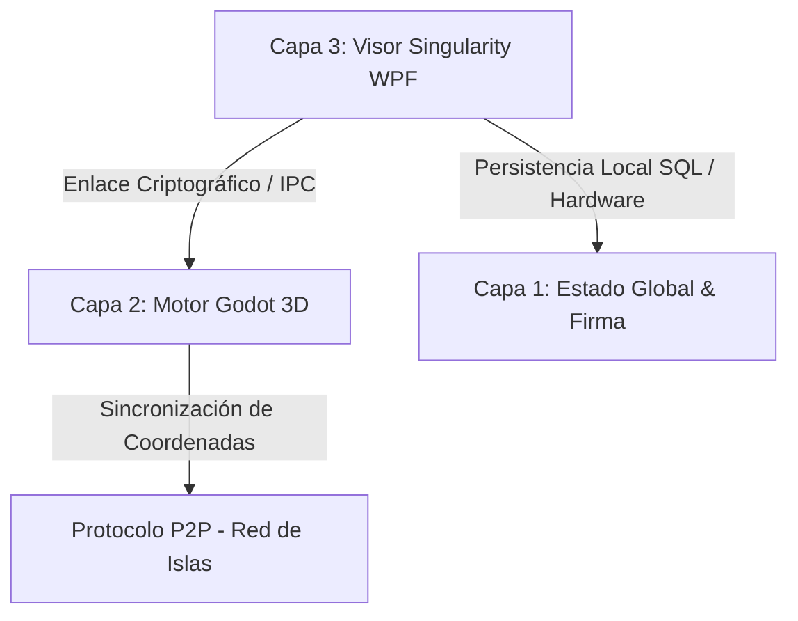

# ⬢ WoldVirtual P2P 3D — Metaverso Cripto Descentralizado

> **🎯 Estado del Proyecto:** Prototipo Funcional de Alta Fidelidad y Visor Estético Completado.
> Integración fluida del motor 3D de Godot incrustado en un visor WPF moderno y descentralizado de 3 Capas.

---

## 🔍 Arquitectura de 3 Capas Implementada

La arquitectura actual del proyecto conecta de forma segura el motor de renderizado 3D, la lógica de red local P2P y la persistencia criptográfica en el sistema de la siguiente manera:

1. **Capa 1: Persistencia y Firma (Estado Global):**
   * **Base de Datos SQLite:** Almacenamiento local seguro de identidades vinculadas a firmas de hardware.
   * **Criptografía de Hardware (Fingerprint):** Algoritmo de hash SHA-256 generado a partir de IDs únicos de CPU, Placa Base y Sistema Operativo obtenidos mediante WMI.
   * **Firma Digital Cuántica:** Exportación e importación segura de claves en un paquete `.zip` comprimido que resguarda la llave cuántica local.

2. **Capa 2: Motor Gráfico (Godot Engine):**
   * **Godot 4.6.2 Stable (Mono / C# / OpenGL3):** Renderizado en caliente embebido directamente mediante controladores nativos.
   * **Lógica del Mundo P2P:** Teletransporte P2P, gestión de físicas del avatar, renderizado de islas y shaders integrados.

3. **Capa 3: Visor Singularity (WPF / .NET 8):**
   * **Flujo del Wizard en 4 Pasos:** Registro guiado, generación automática de firma, validación de MetaMask y asignación de coordenadas de islas.
   * **Puente HTTP Local (Puerto 8080):** Pasarela de comunicación segura que intercepta la firma de MetaMask desde el navegador para transferirla directamente al Visor WPF.

---

## 🚀 Logros y Hitos Completados (Sesión de Rediseño)

### 💎 Rediseño Estético desde Cero del Visor WPF (`MainWindow.xaml`)
Se ha implementado una interfaz visual de altísima calidad inspirada en las mejores prácticas de la estética cyberpunk e interfaces tácticas de ciencia ficción:
* **Glow & Glassmorphism:** Paneles de cristal esmerilado con fondo translúcido (`#F2080E1C`), bordes cian muy sutiles y efectos de resplandor mediante sombras difusas y desenfocadas de neón.
* **Control Chrome Personalizado:** Ventana fija a `1600x950` sin barra nativa de Windows (`WindowStyle="None"`, `NoResize`) para evitar deformaciones físicas en el avatar, incorporando controles minimalistas de Minimizar y Cerrar con respuestas visuales interactivas.
* **Visuales y Inputs Premium:** Campos de entrada iluminados con transiciones de color en hover/foco y botones de acción dinámicos en neón cian, verde esmeralda y magenta.
* **HTTP Bridge Wait Overlay:** Alerta premium de validación de MetaMask con una barra animada que pulsa de forma infinita mientras escucha el puerto local.

### 🎮 Integración Total de Godot e Inmersión del Viewport 3D
* **Solución de Vibración del Avatar:** Fijación del visor nativo a coordenadas exactas y estiramiento por GPU, eliminando la vibración del avatar causada por constantes cambios de escala y recálculos en el `HwndHost`.
* **Modo Inmersivo 100%:** Al arrancar el metaverso, el `PanViewportContainer` se expande ocupando el **100% de la ventana** (`Grid.RowSpan="3"`, `Panel.ZIndex="99"`, `Stretch`).
* **Visualización Perfecta de Godot UI:** El panel interno de control de Godot ("RED P2P") y sus menús superiores ya no se solapan ni se ven obstruidos por barras laterales de WPF, disfrutando de toda la resolución de pantalla.
* **Desacoplamiento de Cierre Seguro (Cerrar Sesión):** Implementación de una bandera de exclusión (`_ignoreGodotExit`) que previene que WPF aborte el proceso global del visor al apagar Godot durante el teletransporte o el retorno al menú de inicio de sesión.
* **Dummy Controller de Retrocompatibilidad:** Todos los componentes requeridos por el código-detrás (`MainWindow.xaml.cs`) para su lógica interna (como la barra lateral antigua `PanSidebar`, anchos `ColSidebar` y etiquetas de islas) se mantuvieron encapsulados en un Grid oculto (`Visibility="Collapsed"`). Esto garantiza **cero errores de compilación y cero NullReferenceException** en tiempo de ejecución.

---

## 📅 Próximos Pasos en el Prototipo

1. **Pruebas de Concurrencia Multijugador:**
   * Iniciar dos instancias del Visor Singularity simulando diferentes firmas digitales y comprobar la sincronización del estado espacial 3D y la presencia del avatar.
2. **Refinamiento del Cierre de Sesión (Cerrar Sesión):**
   * Refinar el retorno y limpieza total de la memoria e hilos de ejecución de sockets tras múltiples cierres e inicios de sesión consecutivos en el visor P2P.
3. **Refinamiento de Assets P2P:**
   * Continuar optimizando el renderizado gráfico de las islas y la sincronización de archivos JSON en tiempo real sin dependencias externas o servidores centralizados.

## ☀️ Verano de IAs: Roadmap Estratégico de Desarrollo (Core P2P)

**Período:** 25 de junio al 31 de agosto (67 días de desarrollo intensivo).
**Capacidad:** 4 horas/día = 268 horas totales.
**Metodología de Desarrollo AI-Assisted:** Asignación de 67 horas dedicadas a cada entorno/agente (Antigravity, Cursor, Trae, VS Code), maximizando el paralelismo cognitivo para construir la infraestructura de red descentralizada del metaverso.

---

### 📅 Fase 1: Criptografía de Hardware, Identidad y Sockets Base (Días 1 a 20)
* **Objetivo Maestro:** Establecimiento de la capa de transporte segura y generación de identidades únicas irrefutables vinculadas al hardware físico.
* **Hito Técnico:** Dos nodos pueden descubrirse mutuamente en la red local e intercambiar un *handshake* criptográfico sin depender de servidores DNS o intermediarios centrales.

* **Distribución del Flujo de Trabajo (4 Horas/Día):**
  * ⏱️ **Hora 1 (Antigravity - Arquitectura & Diseño):** Análisis algorítmico y viabilidad de los modelos de Hash. Diseño del esquema de seguridad (SHA-256 + Salts aleatorios) para extraer IDs de hardware (CPU, Placa Base, OS) garantizando colisiones nulas y mitigando vectores de ataque de suplantación de identidad en el juego.
  * ⏱️ **Hora 2 (Cursor - Desarrollo Core C#):** Implementación exhaustiva de la lógica de identidad (`HardwareFingerprint.cs`). Programación de las consultas WMI (Windows Management Instrumentation) seguras y la serialización para encapsular la firma digital en paquetes comprimidos y encriptados de exportación (`.zip`).
  * ⏱️ **Hora 3 (Trae - Implementación de Red):** Programación del servidor TCP/IP asíncrono y los *listeners* de red (`TcpListener`). Creación de los pools de hilos de alto rendimiento y las rutinas de *heartbeat* (latidos) para mantener vivos los sockets P2P y manejar las desconexiones súbitas de los jugadores.
  * ⏱️ **Hora 4 (VS Code - QA, Refactor y Testing):** Consolidación estructural del código. Ejecución de pruebas de humo (*smoke testing*) levantando múltiples instancias simultáneas en bucle local (loopback `127.0.0.1`), comprobando la persistencia en SQLite y validando que no se generen fugas de sockets no cerrados.

* **Entregable:** Librería Core de enlace de red que permite conectar dos Visores Singularity directamente de igual a igual (P2P) y validar la sesión mediante firmas.

---

### 📅 Fase 2: Motor de Tráfico, Throttling y Distribución Descentralizada (Días 21 a 40)
* **Objetivo Maestro:** Implementación del sistema de distribución de archivos (*file-sharing* P2P) con control estricto de recursos físicos del jugador.
* **Hito Técnico:** Capacidad de compartir el cliente/visor (.zip del juego base) y los *assets* 3D de las islas sin superar jamás el límite estricto *hard-coded* de **300 MB** de subida por nodo.

* **Distribución del Flujo de Trabajo (4 Horas/Día):**
  * ⏱️ **Hora 1 (Antigravity - Arquitectura & Diseño):** Diseño del algoritmo *Token Bucket* o *Leaky Bucket* para la modelación del ancho de banda (Throttling). Análisis de la fragmentación óptima de paquetes y prevención de interbloqueos ante congestiones de red en enrutadores domésticos.
  * ⏱️ **Hora 2 (Cursor - Desarrollo Core C#):** Codificación del motor de transferencia por *chunks* (fragmentos asíncronos en RAM). Implementación de los limitadores de subida mediante `Task.Delay` dinámicos, que calibran milisegundo a milisegundo los *bytes-per-second* en el torrente de transmisión.
  * ⏱️ **Hora 3 (Trae - Implementación de Red):** Gestión multiplexada de conexiones masivas concurrentes. Asegurar que si 10 usuarios solicitan archivos simultáneamente de un solo jugador, el límite total de salida se reparta matemáticamente de forma justa (ej. max. 30 MB por conexión simultánea), evitando estrangular la línea del anfitrión.
  * ⏱️ **Hora 4 (VS Code - QA, Refactor y Testing):** Profiling de estrés en entornos simulados de red con altas latencias. Monitoreo automatizado para certificar frente al *Administrador de Tareas* de Windows que el consumo de ancho de banda jamás supera el umbral máximo exigido.

* **Entregable:** Motor de transferencia modular capaz de actuar como un ecosistema "BitTorrent" encriptado privado, asegurando que el instalador de WoldVirtual se auto-distribuya de manera viral y sostenible entre la comunidad.

---

### 📅 Fase 3: Estado Global, Sincronización JSON y "Cero Absoluto" (Días 41 a 60)
* **Objetivo Maestro:** Sincronización descentralizada del estado universal del metaverso (las miles de islas generadas) garantizando la consistencia eventual y descentralizada de los datos.
* **Hito Técnico:** Todo nodo es capaz de asimilar, fusionar y persistir su archivo `estado_metaverso.json` maestro de forma atómica y sin pisarse con los avances de otros jugadores en la red.

* **Distribución del Flujo de Trabajo (4 Horas/Día):**
  * ⏱️ **Hora 1 (Antigravity - Arquitectura & Diseño):** Modelado estructural de base de datos JSON en esquemas CRDT (*Conflict-free Replicated Data Types*). Estrategia heurística basada en marcas de tiempo (Relojes de Lamport) para dictaminar automáticamente el estado final si dos jugadores plantan una isla en la misma hora exacta.
  * ⏱️ **Hora 2 (Cursor - Desarrollo Core C#):** Implementación de la directiva algorítmica del "Cero Absoluto" `(0, 0, 0)`. Lógica genética: cuando un nodo arranca y no detecta pares en la red (o pierde el contacto total con la DHT), inicia su tabla vacía y genera la coordenada base Génesis de inmediato.
  * ⏱️ **Hora 3 (Trae - Implementación de Red):** Sincronización diferencial extrema (*Delta Syncing*). En lugar de enviar un archivo gigantesco con todo el universo cada segundo, se programan rutinas de comparación que extraen únicamente los registros de islas modificados o creados en los últimos minutos (Deltas), reduciendo el consumo de red a ínfimos *Kilobytes*.
  * ⏱️ **Hora 4 (VS Code - QA, Refactor y Testing):** Simulaciones intensivas de "Cerebro Dividido" (*Split-brain network partitioning*). Aislar dos grupos de nodos intencionadamente, poblar de islas sus redes y reconectarlos posteriormente para comprobar la curación automática del estado mediante la fusión inteligente y fluida del JSON.

* **Entregable:** Matriz de almacenamiento inmutable y distribuida. Un cosmos virtual cuyo "recuerdo" de todas las construcciones perdurará mientras haya un nodo encendido.

---

### 📅 Fase 4: Integración 3D en Godot, Desacoplamiento y Cierre Open Source (Días 61 a 67)
* **Objetivo Maestro:** Enlazar el poderoso y asíncrono puente C# P2P con el contexto gráfico, el sistema de físicas y el renderizado interno de Godot 4.6.2.
* **Hito Técnico:** Representar visualmente las transacciones P2P en pantalla 3D; donde cada avatar e isla reaccione instantáneamente al paso de paquetes TCP/UDP sin causar *Stuttering* o caída de FPS.

* **Distribución del Flujo de Trabajo (4 Horas/Día):**
  * ⏱️ **Hora 1 (Antigravity - Arquitectura & Diseño):** Profiling final de paralelismo multihilo. Revisión pormenorizada para extirpar *Deadlocks* (cuellos de botella por esperas de hilos compartidos) en la comunicación IPC (Inter-Process) entre el entorno WPF de .NET 8 y la instancia nativa del motor de Godot.
  * ⏱️ **Hora 2 (Cursor - Desarrollo Core C#):** Transpositor universal de coordenadas espaciales. Algoritmo crítico para concatenar la posición general macro: `(Posición Matemática Real = Eje de la Isla Macro + Posición de Avatar Micro)`. Resolución y refactorización orientada a dobles (`double precision`) previniendo colapsos de cálculo flotante al explorar los límites más lejanos del Metaverso 3D.
  * ⏱️ **Hora 3 (Trae - Implementación de Red):** Enrutamiento predictivo y "Co-Seeding" preventivo de assets (Modelos, texturas). El nodo inteligente precarga fragmentos de mapa en segundo plano extrapolando el trayecto del avatar, dotando a la experiencia inmersiva de cero pantallas de carga.
  * ⏱️ **Hora 4 (VS Code - QA, Refactor y Testing):** Pulido terminal del árbol de ramas en Github, incorporación integral de XML Docs en interfaces C# y formateo general con linting. Cierre absoluto de incidencias residuales para garantizar que el compilador refleje **cero errores y cero advertencias** en la solución Release final.

* **Entregable:** El lanzamiento definitivo (*v1.0.0 Alpha*) del core distribuido WoldVirtual; un ecosistema documentado, seguro y abierto, capacitado para que cualquier usuario instale la semilla tecnológica y propague el juego libremente.
