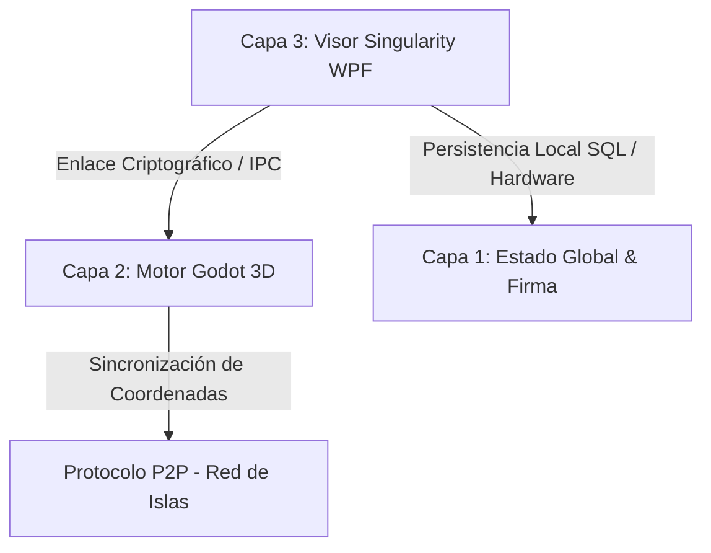

# ⬢ WoldVirtual P2P 3D — Metaverso Cripto Descentralizado

> **🎯 Estado del Proyecto:** Prototipo Funcional de Alta Fidelidad y Visor Estético Completado.
> Integración fluida del motor 3D de Godot incrustado en un visor WPF moderno y descentralizado de 3 Capas.

---

## 🔍 Arquitectura de 3 Capas Implementada

La arquitectura actual del proyecto conecta de forma segura el motor de renderizado 3D, la lógica de red local P2P y la persistencia criptográfica en el sistema de la siguiente manera:

1. **Capa 1: Persistencia y Firma (Estado Global):**
   * **Base de Datos SQLite:** Almacenamiento local seguro de identidades vinculadas a firmas de hardware.
   * **Criptografía de Hardware (Fingerprint):** Algoritmo de hash SHA-256 generado a partir de IDs únicos de CPU, Placa Base y Sistema Operativo obtenidos mediante WMI.
   * **Firma Digital Cuántica:** Exportación e importación segura de claves en un paquete `.zip` comprimido que resguarda la llave cuántica local.

2. **Capa 2: Motor Gráfico (Godot Engine):**
   * **Godot 4.6.2 Stable (Mono / C# / OpenGL3):** Renderizado en caliente embebido directamente mediante controladores nativos.
   * **Lógica del Mundo P2P:** Teletransporte P2P, gestión de físicas del avatar, renderizado de islas y shaders integrados.

3. **Capa 3: Visor Singularity (WPF / .NET 8):**
   * **Flujo del Wizard en 4 Pasos:** Registro guiado, generación automática de firma, validación de MetaMask y asignación de coordenadas de islas.
   * **Puente HTTP Local (Puerto 8080):** Pasarela de comunicación segura que intercepta la firma de MetaMask desde el navegador para transferirla directamente al Visor WPF.

---

## 🚀 Logros y Hitos Completados (Sesión de Rediseño)

### 💎 Rediseño Estético desde Cero del Visor WPF (`MainWindow.xaml`)
Se ha implementado una interfaz visual de altísima calidad inspirada en las mejores prácticas de la estética cyberpunk e interfaces tácticas de ciencia ficción:
* **Glow & Glassmorphism:** Paneles de cristal esmerilado con fondo translúcido (`#F2080E1C`), bordes cian muy sutiles y efectos de resplandor mediante sombras difusas y desenfocadas de neón.
* **Control Chrome Personalizado:** Ventana fija a `1600x950` sin barra nativa de Windows (`WindowStyle="None"`, `NoResize`) para evitar deformaciones físicas en el avatar, incorporando controles minimalistas de Minimizar y Cerrar con respuestas visuales interactivas.
* **Visuales y Inputs Premium:** Campos de entrada iluminados con transiciones de color en hover/foco y botones de acción dinámicos en neón cian, verde esmeralda y magenta.
* **HTTP Bridge Wait Overlay:** Alerta premium de validación de MetaMask con una barra animada que pulsa de forma infinita mientras escucha el puerto local.

### 🎮 Integración Total de Godot e Inmersión del Viewport 3D
* **Solución de Vibración del Avatar:** Fijación del visor nativo a coordenadas exactas y estiramiento por GPU, eliminando la vibración del avatar causada por constantes cambios de escala y recálculos en el `HwndHost`.
* **Modo Inmersivo 100%:** Al arrancar el metaverso, el `PanViewportContainer` se expande ocupando el **100% de la ventana** (`Grid.RowSpan="3"`, `Panel.ZIndex="99"`, `Stretch`).
* **Visualización Perfecta de Godot UI:** El panel interno de control de Godot ("RED P2P") y sus menús superiores ya no se solapan ni se ven obstruidos por barras laterales de WPF, disfrutando de toda la resolución de pantalla.
* **Desacoplamiento de Cierre Seguro (Cerrar Sesión):** Implementación de una bandera de exclusión (`_ignoreGodotExit`) que previene que WPF aborte el proceso global del visor al apagar Godot durante el teletransporte o el retorno al menú de inicio de sesión.
* **Dummy Controller de Retrocompatibilidad:** Todos los componentes requeridos por el código-detrás (`MainWindow.xaml.cs`) para su lógica interna (como la barra lateral antigua `PanSidebar`, anchos `ColSidebar` y etiquetas de islas) se mantuvieron encapsulados en un Grid oculto (`Visibility="Collapsed"`). Esto garantiza **cero errores de compilación y cero NullReferenceException** en tiempo de ejecución.

---

## 📅 Próximos Pasos en el Prototipo

1. **Pruebas de Concurrencia Multijugador:**
   * Iniciar dos instancias del Visor Singularity simulando diferentes firmas digitales y comprobar la sincronización del estado espacial 3D y la presencia del avatar.
2. **Refinamiento del Cierre de Sesión (Cerrar Sesión):**
   * Refinar el retorno y limpieza total de la memoria e hilos de ejecución de sockets tras múltiples cierres e inicios de sesión consecutivos en el visor P2P.
3. **Refinamiento de Assets P2P:**
   * Continuar optimizando el renderizado gráfico de las islas y la sincronización de archivos JSON en tiempo real sin dependencias externas o servidores centralizados.
